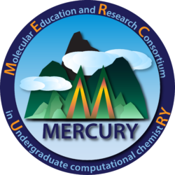
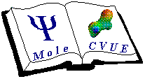
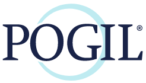

# POGIL-PCL

<https://www.pogilpcl.org>

POGIL-Physical Chemistry Laboratory is a group of several dozen physical chemists working together to make the physical chemistry lab course and engaging and meaningful learning experience. Through this work an enthusiastic community arose. POGIL-PCL organizes online and in-person workshops, a reading club (with synchronous online discussions), a newsletter, and laboratory development workshops. [Get connected.](https://www.pogilpcl.org/get-connected)

Experiment highlights and student versions of lab experiments are available in the PIPER [Teaching Resources](https://chemistry.coe.edu/piper/resources.html#category=pogil-pcl) and in the POGIL-PCL [experiment catalog](https://www.pogilpcl.org/catalog).

# LABSIP

<https://labsip.org/>

LABSIP (Lowering Access Barriers to Success in Physical Chemistry) is a collaborative
project led by eleven physical chemistry instructors and funded initially by Research Corporation for Science Advancement. Our short-term goal is community engagement around new directions in Physical Chemistry instruction, with a longer-term goal of providing guidelines and resources towards a more inclusive, dynamic, and current physical chemistry curriculum.

# MoLSSI Education

<http://education.molssi.org/>

Education of students, post-docs, and faculty on programming and Best Practices in Software Development is a large part of MolSSI&rsquo;s mission. Our education program consists of our cohorts of Software Fellows, online training materials, and online and in-person workshops at various locations across the U.S. each year.

MolSSI’s education techniques and practices are modeled after The Carpentries style to teaching novice software best practices. We engage large portions of the CMS community (and beyond) through demographically and geographically diverse workshops aimed at both novice and intermediate learners.

# MERCURY Consortium

[https://www.mercuryconsortium.org/](https://www.mercuryconsortium.org/)

The consortium, known as the Molecular Education and Research Consortium
in Undergraduate computational chemistRY (MERCURY) was founded with the goal of establishing research collaboration among seven computational chemistry faculty from primarily undergraduate institutions (PUIs). The consortium members share NSF-funded computational facilities and meet at an annual MERCURY conference to network and present their research.

# MoleCVUE

[https://sites.google.com/view/molecvue](https://sites.google.com/view/molecvue/news)

The MoleCVUE consortium is an association of faculty at Primarily Undergraduate Institutions (PUIs) who share the common purpose expressed by our name: Molecular Computation and Visualization in Undergraduate Education. Participants at recent meetings have come from a variety of academic institutions.

Our areas of interest include not only chemistry and biochemistry, but also material science, molecular biology, and other areas where the ruling paradigm is &ldquo;molecules.&rdquo; 

Our objectives are to enhance our own undergraduate instruction by developing and employing modern computational and visualization tools and to provide the methods, techniques, and tools we develop freely  to other science instructors.

The MoleCVUE consortium provides:

-   A forum for expressing one&rsquo;s own ideas and receiving criticism and suggestions;
-   A channel for awareness of and instruction in computer tools and techniques;
-   Extended meetings with like-minded colleagues from which collaborative projects and products may emerge.
-   Activities that introduce undergraduate students to computational chemistry and allow them to present the results of their work.

# Engaging Students in Physical Chemistry

<https://groups.google.com/g/engaging-students-in-physical-chemistry>

The idea for this Google group began in the Engaging Students in Physical Chemistry symposium at the 2014 Biennial Conference on Chemical Education.  This idea was revived at the 2016 BCCE and continues to today.  I&rsquo;d like to make this group useful for you.  Thanks!  &#x2013;Craig Teague, Cornell College, Mount Vernon IA

# POGIL

<https://www.pogil.org/our-community>

POGIL = Process-Oriented Guided-Inquiry Learning

As a member of the POGIL community, you are part of something bigger than yourself.  You are empowering students to become more self-directed, inquisitive, independent thinkers  and helping them develop skills to be successful leaders and problem solvers. As a practitioner, you are joining a community of like-minded educators who share similar goals in advancing best practices in student-centered learning and who also enjoy spending time together. We are not just an organization&#x2026;we are a community working together to bring about true change in education.

