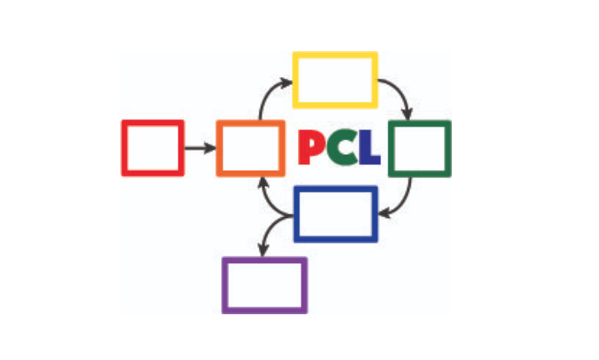
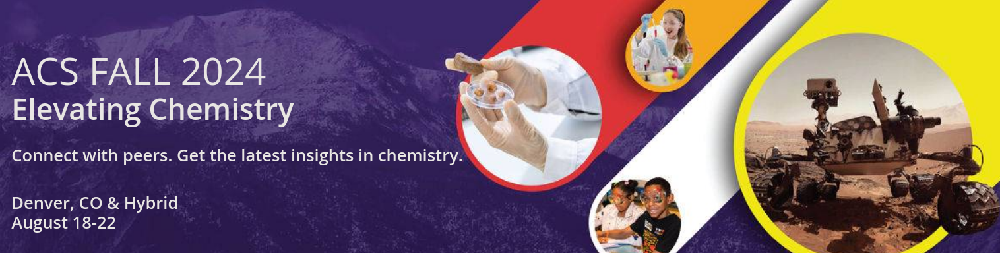
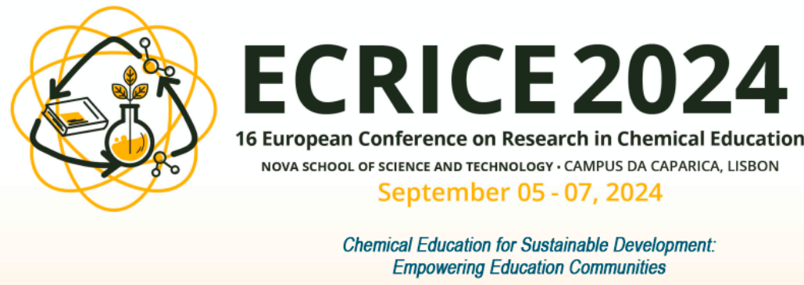

Please send your event announcement to Steve Singleton ssinglet@coe.edu

## POGIL-PCL Journal Discussion

August 13, 2-3 pm Eastern time

The POGIL-PCL Journal Group will discuss two versions of the &ldquo;classic temperature dependence of vapor pressure&rdquo; experiment alongside a recent paper describing a simple, [inexpensive isoteniscope](https://pubs.acs.org/doi/10.1021/acs.jchemed.3c01138). Please use this form to indicate your interest in this discussion, which will be led by Brian Gilbert and Michael Everest: [https://forms.gle/Ppj9AoGsC7a798Yy5](https://forms.gle/Ppj9AoGsC7a798Yy5)

## MOLSSI Two-Day Workshop on Python Scripting and AI-Assisted Coding

[Workshop on Python Scripting and AI-Assisted Coding](https://molssi.org/two-day-workshop-on-python-scripting-and-ai-assisted-coding/)

August 17-18, 2024

Join us for an engaging two-day workshop designed to teach programming and data
handling skills using Python for people working in the molecular sciences and learn how to speed and enhance your learning using artificial intelligence. This event is ideal for students and professionals eager to get started with Python scripting and interested in leveraging AI tools like ChatGPT to learn coding faster and more efficiently. Location: CU Denver campus (0.25 miles from Convention center where ACS convention is being held)

## ACS Fall 2024: Elevating Chemistry

<https://www.acs.org/meetings/acs-meetings/fall.html>

August 18-22, 2024

Ways to Attend: The ACS Meetings & Expos are now hybrid with sessions in-person and virtual. You can register for hybrid, with access to both in-person and virtual sessions, or only virtual.

## ECRICE 2024: European Conference on Research in Chemical Education

September 5-7, 2024

<https://ecrice2024.events.chemistry.pt/>

It is relevant to examine different learning environments, new educational tools, and new ways in which neuroeducation, technology and artificial intelligence, can be integrated into chemical education, and promote the engagement of students in the learning process.

The ECRICE24 Committees of this International conference invite all chemistry education researchers and teachers to come to the conference and challenge them to showcase presentations, submit abstracts, and present work, regarding new developments in Chemical Education, through the lens of sustainable goals, and participate in the ECRICE 2024 meeting. 

We are looking forward to welcoming you in Lisbon.

## POGIL-PCL Journal Discussion

September 23, 2024, 3-4 pm Eastern time

The POGIL-PCL Journal Group will discuss the paper &ldquo;Recommendations for Improving End-User Programming Education: A Case Study with Undergraduate Chemistry Students&rdquo;, Fuchs, et al. <https://doi.org/10.1021/acs.jchemed.4c00219> (Creative Commons). Please use [this google form](https://forms.gle/2L2yrPpxubfV4q1LA) to indicate your interest in participating.

# Past events

## Biennial Conference on Chemical Education (BCCE)

<https://bcce.divched.org/>

Jul 28–Aug 1, 2024 

The Biennial Conference on Chemical Education (BCCE) is a national meeting sponsored by the Division of Chemical Education (DivCHED) of the American Chemical Society (ACS). The conference is designed for those who teach chemistry at all levels: K-12, secondary school science teachers, undergraduate students, graduate students and post-secondary chemistry faculty.

The conference provides chemistry educators with opportunities for interacting with colleagues at all levels in formal and informal settings. Instructors who are new to chemistry education and those who have years of teaching experience will find this conference to be an excellent source of materials, techniques and chemistry content.

## 27th IUPAC International Conference on Chemistry Education (ICCE2024)

[https://iupac.org/event/chemistry-education-icce2024/](https://iupac.org/event/chemistry-education-icce2024/)

15 Jul 2024 - 19 Jul 2024

The program is designed to discuss the role of chemistry education not only in classroom setting but also in societal context. Novel teaching and learning methods in chemistry are still the key topics in this conference. Professional development of educators at all levels (school and university) will be included. Societal context of chemistry education such as sustainability, ethics, diversity, equity, and inclusion will also be emphasized in this conference. ICCE 2024 will also include the 12th International Symposium on Microscale Chemistry.

## POGIL-PCL Hybrid Workshop

July 11, 2024

The POGIL-PCL team will host a hybrid zoom workshop on July 11, 12-4 pm Eastern time. We will do a new POGIL-PCL experiment, &ldquo;What is the pKa of an Acid-Base Indicator?&rdquo;, developed by Rebecca Michelsen. Each participant will do the experiment in their own laboratory - with discussions happening over zoom in real time.

To participate fully, you should have a computer with audio and video capability as well as access to Google drive. To get the most out of the experience, participants will also complete pre-experiment questions outside of the workshop time. Participants will also need to prepare stock solutions and set up spectrometers to carry out measurements during the four-hour workshop.

Please use this form to indicate your interest in participating in this hybrid workshop:  
[https://forms.gle/gn7d6y6CpLcJv271A](https://forms.gle/gn7d6y6CpLcJv271A)

## MDAnalysis/MolSSI Workshop at Arizona State University

June 24th-25th, 2024

MDAnalysis, in conjunction with the Molecular Sciences Software Institute(MolSSI) and
with the support of the Chan Zuckerberg Initiative, and the Center for Biological Physics, is holding a free, 2-day workshop on June 24th-25th, 2024 at Arizona State University in Tempe, Arizona, USA.

This two-day workshop is designed to transform attendees from users to developers and will cover an introduction to MDAnalysis, software best practices, and guide participants through the creation of their own MDAKit. Specifically, the workshop will include 3 modules:

1.  An introduction to using and writing custom analyses in MDAnalysis;
2.  An overview of software development and maintenance best practices;
3.  An interactive hackathon session where participants write their own MDAKits.

[MOLSSI Workshop at Arizona State University](https://molssi.org/mdanalysis-molssi-workshop-at-arizona-state-university/)

## POGIL-PCL Journal Discussion

June 11, 2-3pm EDT

We will host a discussion of an article titled &ldquo;Alternative Assessment to Lab Reports: A Phenomenology Study of Undergraduate Biochemistry Students’ Perceptions of Interview Assessment&rdquo; (J. Chem. Educ., Burrows et al.). Please complete this form if you are interested in participating in this discussion: <https://forms.gle/Kcv2xNjGSTQL4sSD7>. Google calendar invitations will go out on June 7. 

## ESCIP2024 Workshop: “Teaching scientific computing at the dawn of AI”

Iowa State University from May 30-31, 2024
<https://escip.io/workshops/workshop2024.html>

The central theme of ESCIP2024 workshop is devising new strategies for teaching scientific computing at the time where ChatGPT and similiar disruptive generative AI technologies are changing the way we learn and solve problems.

The workshop will be a combination of keynote and lightning talks, work in small groups, brainstorming sessions and also a training program for anyone interested in learning the best practices for using python based computaation in undergraduate STEM courses.

Research Corporation for Science Advancement (RCSA) is sponsoring the event. Funding will be used to cover the travel and meals during the event.

Registration to attend is free but you must RSVP to reserve a spot! please fill out the registration form by April 25, 2024

## POGIL-PCL Zoom Workshop

The POGIL-PCL team will host a moderated zoom workshop November 2 & 9, 2023, from 7pm-9pm Eastern time. We will work through the experiment, &ldquo;What can an IR spectrum tell you about a molecule?&rdquo; More details about the experiment: <https://chemistry.coe.edu/piper/posts/gas-phase-ir-pcl/>

Teams of participants will work through the experiment and have time to discuss the experiment. Moderators will do regular check-ins and be available for questions, and they will lead discussions on POGIL-PCL and facilitation.

Please complete this form, <https://forms.gle/8YmUuKTEHXpsPUjy6> to let us know your interest in this workshop.

To participate fully, you should have a computer with audio and video capability as well as access to Google drive. To get the most out of the experience, participants will also complete pre-experiment questions outside of the workshop time.

This experiment was recently highlighted in the special issue of J. Chem. Educ. last December: <https://doi.org/10.1021/acs.jchemed.2c00314>

## MOLSSI QCArchive Webinar

Computational chemists: MolSSI is having a webinar on Thursday, Sept. 21, 2023 introducing their new QCArchive Software.  QCArchive is a MolSSI open-source software product that helps you run and archive results for QM calculations.  The webinar is totally introductory, so no experience with QCArchive is needed to attend.  Find out more at <https://molssi.org/introduction-to-qcarchive-free-online-webinar/>

## LABSIP and ACS PHYS Innovative Teaching in Physical and Computational Chemistry

ACS New Orleans, March 18, 2024, 7:30-9:30 pm

The organizers of LABSIP and the ACS PHYS Innovative Teaching in Physical and Computational Chemistry: Making Stronger Connections to Students and Faculty symposium are excited to announce an opportunity for community building among physical chemistry educators at the upcoming ACS meeting in New Orleans. With generous support from Research Corporation for Science Advancement, Cottrell Collaborative, and Schrodinger Online Learning, we will be holding an evening reception on Monday, March 18, 2024, 7:30-9:30 pm at Annunciation (1016 Annunciation St., New Orleans) to welcome everyone to the ACS meeting.

If you are planning to attend the evening reception, please RSVP using the following link: <https://forms.gle/TDNAVbEmcvi3Sx7WA>

LABSIP [Discord community](https://discord.gg/RqVcn6meja)

## LABSIP event at August ACS meeting

Informal coffee hour on Monday August 14, 2023 from about 9:15-11:15 am PDT in the Moscone Center South, 200 level near PHYS and COMP talks.  Please come say hi!  Bring friends! Coffee and snacks will be provided.

