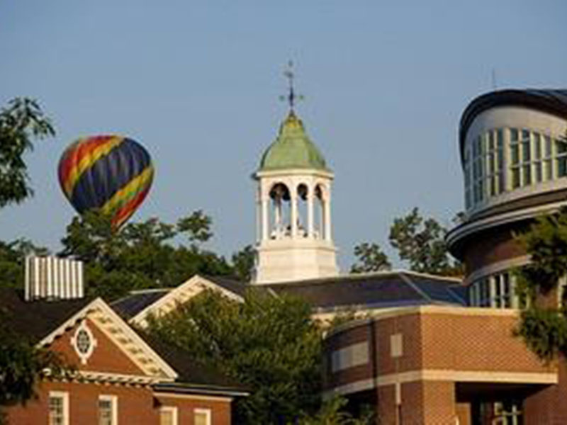
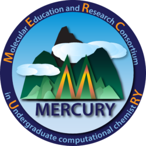
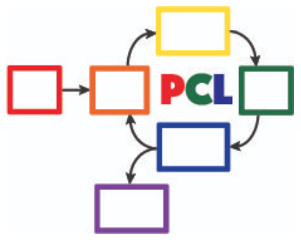

*Please send your event announcement to Steve Singleton ssinglet@coe.edu*

# Gordon Research Conference July 2025

July 6 - 11, 2025

<https://www.grc.org/chemistry-education-research-and-practice-conference/2025/>

As 2025 approaches, we are on the cusp of making some major decisions about our discipline, its future, and our focus in thinking about students’ learning and our teaching. 
This meeting intends to act as a prompt to draw on the latest research and scholarly activity to help us address the future paths where our discipline is headed. The conference will focus specifically on pertinent themes relating to the above, with invited talks and participant posters aligning to one or more of the following:

-   Methodological approaches to exploring student understanding and reasoning
-   Reforming teaching approaches for a new era of chemistry education
-   Refocusing on the role of laboratory teaching
-   Individualized learning experiences and the role of artificial intelligence in supporting student learning
-   Digital affordances in learning and teaching chemistry
-   Epistemology in chemistry
-   Global perspectives in chemistry education: sustainability, accessibility, and interdisciplinarity

# MOLSSI Two Day Workshop July 2025

July 9-10, 2025, Cal Poly San Luis Obispo, CA

[https://molssi.org/join-the-act-cms-community-workshop-empower-your-teaching-with-python-programming/](https://molssi.org/join-the-act-cms-community-workshop-empower-your-teaching-with-python-programming/)

This workshop is designed for university faculty in the molecular sciences (chemistry, physics, molecular biology, materials science, and related disciplines) who want to learn Python programming and how to incorporate it into their class. This workshop targets faculty who have no or very limited python programming experience and want to upskill and then incorporate cyberinfrastructure skills, like programming, data analysis, data visualization into their courses. The workshop is open to faculty at all academic ranks, including tenure-stream and instructional faculty. 

# MERCURY Consortium July 2025

<https://www.mercuryconsortium.org/conference-2025/>

July 21-25, 2025

The 2025 MERCURY Conference will be hosted by the Department of Chemistry at the University of Pittsburgh with support from the Pittsburgh Quantum Institute.   The Molecular Sciences Software Institute will host a workshop for students on July 21-22, and the MERCURY Conference will start the evening of July 23 and conclude at lunch on July 25. The conference is an excellent forum for undergraduates to present their work and to learn from experts in the field, allowing them to put their own research into perspective. It is equally valuable as a networking event for faculty working with undergraduates. Undergraduates from all types of institutions are invited to come present their work.

# Biennial Conference on Chemical Education 2026

July 26-30, 2026, University of Wisconsin, Madison
[https://conferences.union.wisc.edu/bcce2026/](https://conferences.union.wisc.edu/bcce2026/)

The 29th BCCE will be held on the lakeside campus of the University of Wisconsin–Madison in the Summer of 2026. The conference, like all of its predecessors, provides the chemistry education community with opportunities to interact and engage. The conference will be a mixture of symposia, workshops, poster sessions, exhibits, and spaces for both formal and informal conversations.

All chemistry educators are invited to contribute to the conference by submitting a program proposal (opens August 1, 2025), or abstracts for presentations. You do not have to present in order to attend the BCCE. Also, you do not have to be a member of the American Chemical Society or the ACS Division of Chemical Education to attend or present at the BCCE.

# Past events

## POGIL-PCL Online Workshop April 2025

The POGIL-PCL team, led by Jordan Beck, Andrea Carter, and Diane Miller, will host a zoom workshop on two consecutive Mondays, April 14 & 21, 7-9 pm Eastern time. We will do a new POGIL-PCL experiment, "[Why does the fluorescence of cytochrome c change as it unfolds](https://drive.google.com/file/d/1BPzGviu1ponM3kLwqGHPCYOXe2mhnQwD/view?usp=sharing)?"

Please complete [this form](https://docs.google.com/forms/d/e/1FAIpQLScywqQ4cCedSmtqS5mMXFdwvkTnNfEyTOD0Toetcllf8f7aRA/viewform?usp=sharing) to indicate your interest in attending this workshop.

To participate fully, you should have a computer with audio and video capability as well as access to Google drive. To get the most out of the experience, participants will also complete pre-experiment questions outside of the workshop time.

## POGIL-PCL Journal Discussion

November 11, 2024, 2-3 pm Eastern time

The POGIL-PCL team will host an online zoom discussion of the science practices found in the POGIL-PCL experiment, [How does a molecule's state affect its acidity?](https://drive.google.com/file/d/1sD8DllDoa7E1oc6Jnm4AzH8IxR7O8lUX/view?usp=sharing) We will analyze the first cycle of this experiment based on the process outlined in the paper by [Lavery et al](https://drive.google.com/file/d/1noREgmFzac4rX7Kxl8-isT3NObg2Dkxw/view?usp=sharing).

The discussion will provide you an opportunity to see how science practices are embedded in POGIL-PCL experiments and to learn more about this particular experiment. Please use this [google form](https://forms.gle/GYPEVBzCpZx7MUAD7) to let us know if you are interested in participating. A google calendar link will be sent out prior to the discussion.

## POGIL-PCL Journal Discussion

September 23, 2024, 3-4 pm Eastern time

The POGIL-PCL Journal Group will discuss the paper "Recommendations for Improving End-User Programming Education: A Case Study with Undergraduate Chemistry Students", Fuchs, et al. <https://doi.org/10.1021/acs.jchemed.4c00219> (Creative Commons). Please use [this google form](https://forms.gle/2L2yrPpxubfV4q1LA) to indicate your interest in participating.

## ECRICE 2024: European Conference on Research in Chemical Education

September 5-7, 2024

<https://ecrice2024.events.chemistry.pt/>

It is relevant to examine different learning environments, new educational tools, and new ways in which neuroeducation, technology and artificial intelligence, can be integrated into chemical education, and promote the engagement of students in the learning process.

The ECRICE24 Committees of this International conference invite all chemistry education researchers and teachers to come to the conference and challenge them to showcase presentations, submit abstracts, and present work, regarding new developments in Chemical Education, through the lens of sustainable goals, and participate in the ECRICE 2024 meeting. 

We are looking forward to welcoming you in Lisbon.

## ACS Fall 2024: Elevating Chemistry

August 18-22, 2024

[ACS Fall 2024 Meeting](https://www.acs.org/meetings/acs-meetings/fall.html)

The American Chemical Society Meetings & Expos are now hybrid with sessions in-person and virtual. You can register for hybrid, with access to both in-person and virtual sessions, or only virtual.

## MOLSSI Two-Day Workshop on Python Scripting and AI-Assisted Coding

August 17-18, 2024

[Workshop on Python Scripting and AI-Assisted Coding](https://molssi.org/two-day-workshop-on-python-scripting-and-ai-assisted-coding/)

Join us for an engaging two-day workshop designed to teach programming and data
handling skills using Python for people working in the molecular sciences and learn how to speed and enhance your learning using artificial intelligence. This event is ideal for students and professionals eager to get started with Python scripting and interested in leveraging AI tools like ChatGPT to learn coding faster and more efficiently. Location: CU Denver campus (0.25 miles from Convention center where ACS convention is being held)

## POGIL-PCL Journal Discussion

August 13, 2-3 pm Eastern time

The POGIL-PCL Journal Group will discuss two versions of the "classic temperature dependence of vapor pressure" experiment alongside a recent paper describing a simple, [inexpensive isoteniscope](https://pubs.acs.org/doi/10.1021/acs.jchemed.3c01138). Please use this form to indicate your interest in this discussion, which will be led by Brian Gilbert and Michael Everest: [https://forms.gle/Ppj9AoGsC7a798Yy5](https://forms.gle/Ppj9AoGsC7a798Yy5)

## Biennial Conference on Chemical Education (BCCE)

<https://bcce.divched.org/>

Jul 28–Aug 1, 2024 

The Biennial Conference on Chemical Education (BCCE) is a national meeting sponsored by the Division of Chemical Education (DivCHED) of the American Chemical Society (ACS). The conference is designed for those who teach chemistry at all levels: K-12, secondary school science teachers, undergraduate students, graduate students and post-secondary chemistry faculty.

The conference provides chemistry educators with opportunities for interacting with colleagues at all levels in formal and informal settings. Instructors who are new to chemistry education and those who have years of teaching experience will find this conference to be an excellent source of materials, techniques and chemistry content.

## 27th IUPAC International Conference on Chemistry Education (ICCE2024)

[https://iupac.org/event/chemistry-education-icce2024/](https://iupac.org/event/chemistry-education-icce2024/)

15 Jul 2024 - 19 Jul 2024

The program is designed to discuss the role of chemistry education not only in classroom setting but also in societal context. Novel teaching and learning methods in chemistry are still the key topics in this conference. Professional development of educators at all levels (school and university) will be included. Societal context of chemistry education such as sustainability, ethics, diversity, equity, and inclusion will also be emphasized in this conference. ICCE 2024 will also include the 12th International Symposium on Microscale Chemistry.

## POGIL-PCL Hybrid Workshop

July 11, 2024

The POGIL-PCL team will host a hybrid zoom workshop on July 11, 12-4 pm Eastern time. We will do a new POGIL-PCL experiment, "What is the pKa of an Acid-Base Indicator?", developed by Rebecca Michelsen. Each participant will do the experiment in their own laboratory - with discussions happening over zoom in real time.

To participate fully, you should have a computer with audio and video capability as well as access to Google drive. To get the most out of the experience, participants will also complete pre-experiment questions outside of the workshop time. Participants will also need to prepare stock solutions and set up spectrometers to carry out measurements during the four-hour workshop.

Please use this form to indicate your interest in participating in this hybrid workshop:  
[https://forms.gle/gn7d6y6CpLcJv271A](https://forms.gle/gn7d6y6CpLcJv271A)

## MDAnalysis/MolSSI Workshop at Arizona State University

June 24th-25th, 2024

MDAnalysis, in conjunction with the Molecular Sciences Software Institute(MolSSI) and
with the support of the Chan Zuckerberg Initiative, and the Center for Biological Physics, is holding a free, 2-day workshop on June 24th-25th, 2024 at Arizona State University in Tempe, Arizona, USA.

This two-day workshop is designed to transform attendees from users to developers and will cover an introduction to MDAnalysis, software best practices, and guide participants through the creation of their own MDAKit. Specifically, the workshop will include 3 modules:

1.  An introduction to using and writing custom analyses in MDAnalysis;
2.  An overview of software development and maintenance best practices;
3.  An interactive hackathon session where participants write their own MDAKits.

[MOLSSI Workshop at Arizona State University](https://molssi.org/mdanalysis-molssi-workshop-at-arizona-state-university/)

## POGIL-PCL Journal Discussion

June 11, 2-3pm EDT

We will host a discussion of an article titled "Alternative Assessment to Lab Reports: A Phenomenology Study of Undergraduate Biochemistry Students’ Perceptions of Interview Assessment" (J. Chem. Educ., Burrows et al.). Please complete this form if you are interested in participating in this discussion: <https://forms.gle/Kcv2xNjGSTQL4sSD7>. Google calendar invitations will go out on June 7. 

## ESCIP2024 Workshop: “Teaching scientific computing at the dawn of AI”

Iowa State University from May 30-31, 2024
<https://escip.io/workshops/workshop2024.html>

The central theme of ESCIP2024 workshop is devising new strategies for teaching scientific computing at the time where ChatGPT and similiar disruptive generative AI technologies are changing the way we learn and solve problems.

The workshop will be a combination of keynote and lightning talks, work in small groups, brainstorming sessions and also a training program for anyone interested in learning the best practices for using python based computaation in undergraduate STEM courses.

Research Corporation for Science Advancement (RCSA) is sponsoring the event. Funding will be used to cover the travel and meals during the event.

Registration to attend is free but you must RSVP to reserve a spot! please fill out the registration form by April 25, 2024

