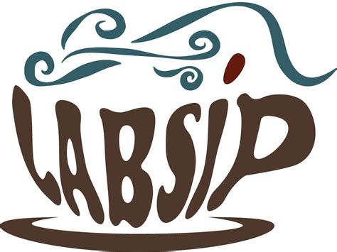

*Please send event announcements to ssinglet@coe.edu*

# LABSIP Social at ACS, August 2025

Monday, August 18 at 7-9 pm ET, contact: [pchemlabsip@gmail.com](mailto:pchemlabsip@gmail.com)

LABSIP will be holding a joint social with the ACS Colloid Mentoring Undergraduate Surface Science Research Symposium during the ACS Fall 2025 meeting in DC. The event will be held at Prost DC on 919 5th St NW in DC. It should be a fun evening and opportunity to network and connect with members of the physical chemistry community.

# POGIL-PCL Journal Discussion, September 2025

Friday, September 12 from 3-4 pm ET [sign up form](https://forms.gle/raCP7JHdukbfy4nL7)

Jordan Beck will lead a discussion of the very broad question: What is physical chemistry?  To address this question and how the answer has evolved, we will look at various artifacts including published and unpublished surveys of physical chemistry educators, the physical chemistry ACCM, and historical ACS Exams physical chemistry exams.  Jordan will lead the discussion and start by giving a brief overview of the artifacts and his initial findings from the ACS Exams archive.  He will then open up the discussion with a special focus on receiving feedback about how to expand the analysis of the ACS Exams physical chemistry exams archive to best serve the needs of the community. [Sign up form](https://forms.gle/raCP7JHdukbfy4nL7)

# Workshop on One Semester Physical Chemistry Courses, September 2025

Tuesday, September 9 at 1 pm – 2 pm ET, contact: [pchemlabsip@gmail.com](mailto:pchemlabsip@gmail.com)

In the Zoom workshop, Drs. Sara Sohail (Swathmore College) and Ashely Ringer McDonald (California Polytechnic State University) will be sharing their experiences teaching/planning a one-semester physical chemistry course. After the talks, workshop attendees will be encouraged to share their ideas on what questions/issues we may want to explore as a community about one-semester physical chemistry courses.

# POGIL-PCL Journal Discussion, October 2025

Wednesday October 15 from 3-4 pm Eastern time, [signup form](https://forms.gle/dd9tQ4jbXQs3GNG39).

Steve Singleton and Sally Hunnicutt will lead a discussion of the paper &ldquo;Ensuring We Assess What We Value in Laboratory Work&rdquo; (A.J. Seen, [J Chem Educ, 2025, 102, 2172-72](https://doi.org/10.1021/acs.jchemed.4c01407)). To sign up, please [complete this form](https://forms.gle/dd9tQ4jbXQs3GNG39).

# Biennial Conference on Chemical Education, July 2026

July 26-30, 2026, University of Wisconsin, Madison
[https://conferences.union.wisc.edu/bcce2026/](https://conferences.union.wisc.edu/bcce2026/)

The 29th BCCE will be held on the lakeside campus of the University of Wisconsin–Madison in the Summer of 2026. The conference, like all of its predecessors, provides the chemistry education community with opportunities to interact and engage. The conference will be a mixture of symposia, workshops, poster sessions, exhibits, and spaces for both formal and informal conversations.

All chemistry educators are invited to contribute to the conference by submitting a program proposal (opens August 1, 2025), or abstracts for presentations. You do not have to present in order to attend the BCCE. Also, you do not have to be a member of the American Chemical Society or the ACS Division of Chemical Education to attend or present at the BCCE.

# Past events

## LABSIP Seminar August 2025

AUGUST 4, 2025 3-4 pm EST.  Contact pchemlabsip@gmail.com to join the zoom meeting.

Craig Teague will speak about his work in physical chemistry pedagogy and the structure of the undergrad physical chemistry curriculum.

Craig is the Associate Dean of Academic Affairs and a Professor of Chemistry at Cornell College. He is co-editor of &ldquo;Engaging Students in Physical Chemistry&rdquo; (<https://pubs.acs.org/doi/book/10.1021/bk-2018-1279>), an ACS Symposium Series eBook, and is at work on a follow-up volume. Craig has co-authored several articles related to chemical pedagogy: “Partition Functions and Statistical Thermodynamics: Spreadsheet Activities to Promote Connections in Physical Chemistry” (<https://pubs.acs.org/doi/10.1021/bk-2018-1279.ch004>), “Focusing on Student Learning: Efforts at Multiple Levels” (<https://pubs.acs.org/doi/10.1021/bk-2020-1343.ch005>) and “The Hydrogen Atom Spectrum: Experimental Analysis Using Iterative Model Building” (<https://pubs.acs.org/doi/10.1021/acs.jchemed.2c00348>). Craig mentioned that he will talk a bit about the hydrogen atom spectrum article to illustrate how he thinks about physical chemistry labs through the POGIL-PCL lens so if you get a chance you might want to look over that article.

## MERCURY Consortium July 2025

<https://www.mercuryconsortium.org/conference-2025/>

July 21-25, 2025

The 2025 MERCURY Conference will be hosted by the Department of Chemistry at the University of Pittsburgh with support from the Pittsburgh Quantum Institute.   The Molecular Sciences Software Institute will host a workshop for students on July 21-22, and the MERCURY Conference will start the evening of July 23 and conclude at lunch on July 25. The conference is an excellent forum for undergraduates to present their work and to learn from experts in the field, allowing them to put their own research into perspective. It is equally valuable as a networking event for faculty working with undergraduates. Undergraduates from all types of institutions are invited to come present their work.

## Gordon Research Conference July 2025

July 6 - 11, 2025

<https://www.grc.org/chemistry-education-research-and-practice-conference/2025/>

As 2025 approaches, we are on the cusp of making some major decisions about our discipline, its future, and our focus in thinking about students’ learning and our teaching. 
This meeting intends to act as a prompt to draw on the latest research and scholarly activity to help us address the future paths where our discipline is headed. The conference will focus specifically on pertinent themes relating to the above, with invited talks and participant posters aligning to one or more of the following:

-   Methodological approaches to exploring student understanding and reasoning
-   Reforming teaching approaches for a new era of chemistry education
-   Refocusing on the role of laboratory teaching
-   Individualized learning experiences and the role of artificial intelligence in supporting student learning
-   Digital affordances in learning and teaching chemistry
-   Epistemology in chemistry
-   Global perspectives in chemistry education: sustainability, accessibility, and interdisciplinarity

## MOLSSI Two Day Workshop July 2025

July 9-10, 2025, Cal Poly San Luis Obispo, CA

[https://molssi.org/join-the-act-cms-community-workshop-empower-your-teaching-with-python-programming/](https://molssi.org/join-the-act-cms-community-workshop-empower-your-teaching-with-python-programming/)

This workshop is designed for university faculty in the molecular sciences (chemistry, physics, molecular biology, materials science, and related disciplines) who want to learn Python programming and how to incorporate it into their class. This workshop targets faculty who have no or very limited python programming experience and want to upskill and then incorporate cyberinfrastructure skills, like programming, data analysis, data visualization into their courses. The workshop is open to faculty at all academic ranks, including tenure-stream and instructional faculty. 

## POGIL-PCL Online Workshop April 2025

The POGIL-PCL team, led by Jordan Beck, Andrea Carter, and Diane Miller, will host a zoom workshop on two consecutive Mondays, April 14 & 21, 7-9 pm Eastern time. We will do a new POGIL-PCL experiment, &ldquo;[Why does the fluorescence of cytochrome c change as it unfolds](https://drive.google.com/file/d/1BPzGviu1ponM3kLwqGHPCYOXe2mhnQwD/view?usp=sharing)?&rdquo;

Please complete [this form](https://docs.google.com/forms/d/e/1FAIpQLScywqQ4cCedSmtqS5mMXFdwvkTnNfEyTOD0Toetcllf8f7aRA/viewform?usp=sharing) to indicate your interest in attending this workshop.

To participate fully, you should have a computer with audio and video capability as well as access to Google drive. To get the most out of the experience, participants will also complete pre-experiment questions outside of the workshop time.

