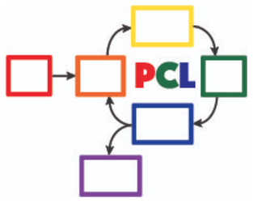

July 11, 2024 The POGIL-PCL team will host a hybrid zoom workshop on July 11, 12-4 pm Eastern time. We will do a new POGIL-PCL experiment, &ldquo;What is the pKa of an Acid-Base Indicator?&rdquo;, developed by Rebecca Michelsen. Each participant will do the experiment in their own laboratory - with discussions happening over zoom in real time.

To participate fully, you should have a computer with audio and video capability as well as access to Google drive. To get the most out of the experience, participants will also complete pre-experiment questions outside of the workshop time. Participants will also need to prepare stock solutions and set up spectrometers to carry out measurements during the four-hour workshop.

Please use this form to indicate your interest in participating in this hybrid workshop:  
[https://forms.gle/gn7d6y6CpLcJv271A](https://forms.gle/gn7d6y6CpLcJv271A)

