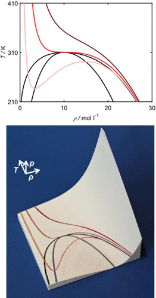

A central element of courses on thermodynamics at universities are the fundamentals of thermophysical property behavior. Thermophysical properties are often complex functions of at least two variables that comprise phase equilibria, metastable phases, critical points, etc. The thermal and caloric property behavior, e.g., $p = p(v, T)$ and $c_v = c_v(T, v)$, of pure substances and vapor–liquid phase equilibria of binary mixtures (pTx) are classical examples. A good spatial imagination is necessary for a complete understanding of the relations of the different properties and different phase regions. In this work, we explore how 3D printing can be used for visualizing thermophysical properties more vividly than classical 2D plots. This is tested using different thermodynamic property examples, e.g., the $p = p(v, T)$ surface of a pure substance with highlights for the binodal, spinodal, critical point, and characteristic isotherms. Also, three-dimensional objects describing fluid phase equilibria in binary mixtures are considered, e.g., azeotropic mixtures. The data for the 3D prints was obtained in this work from molecular-based equations of state. The 3D printed objects aim at providing the students vivid access to the relations and the behavior of thermophysical properties. We report on the first positive experiences using such 3D printed thermophysical properties in teaching.

# Reference

Katharina Koehler, Johann Seibert, Gabriele Hornung, Simon Stephan, *J. Chem. Educ.*, 2025, [doi.org/10.1021/acs.jchemed.5c00277](https://doi.org/10.1021/acs.jchemed.5c00277)

