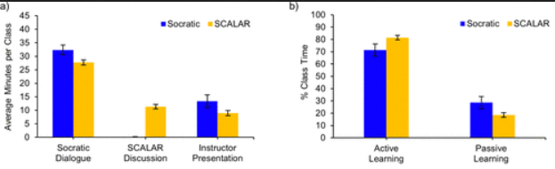

Active learning has been shown to increase student learning outcomes and engagement in STEM (Science, Technology, Engineering, and Mathematics) courses, which has prompted many instructors to integrate more active learning techniques into their classrooms. For the past three decades at Rice University, General Chemistry has been taught using one such approach that combines Socratic dialogue with a curriculum based on the Concept Development Study method. In recent years, we have also developed and analyzed the effectiveness of the Student-Centered Active Learning at Rice (SCALAR) approach, which incorporates regular small group discussions into Socratic dialogue. Here, we report on a side-by-side study directly comparing how these two active learning pedagogies impact the outcomes of three different sets of student groups: silent versus vocal students, female versus male students, and first-generation students versus continuing-generation students. We found that both active learning pedagogies produced significant learning gains for students in all cohorts.

# Reference

Lesa Tran Lu, Katherine A. Clements, Carrie A. Obenland, Kristi Kincaid, Ashlyn H. Munson, John S. Hutchinson, *J. Chem. Educ.*, 2024, [doi.org/10.1021/acs.jchemed.4c00638](https://doi.org/10.1021/acs.jchemed.4c00638)

