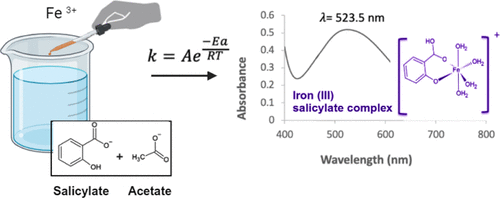

In this three-component laboratory module, upper-division chemistry students were introduced to the kinetics of the aspirin hydrolysis reaction and determined the concentration of its active pharmaceutical ingredient (acetylsalicylic acid-ASA) using a modern, benchtop ultraviolet–visible (UV–vis) absorption spectrophotometer. In the first component, students prepared analyte solutions from over-the-counter aspirin tablets and a relevant number of standards (n = 9–10) through both serial and parallel dilutions. In the second component, the ASA concentrations of three over-the-counter formulations (325 mg per tablet) were determined with percent differences as small as 1.1% using the Beer–Lambert law and external calibration curves. In the third component, students evaluated the reaction order (pseudo-first order), the rate constant (e.g., k = 3.0 × 10–4 s–1 at 75°C), and the activation energy (Ea ∼ 67.3 kJ mol–1) of the hydrolysis reaction of ASA at various temperatures (e.g., 25, 37, 50, 75, and 85°C). The last component was completed using a student-centered instructional approach, namely, process-oriented guided-inquiry learning (POGIL), which helped refine students’ research process skills and both basic and in-depth laboratory skills (weighing, solution handling, micropipetting, operation of a pH meter and a modern, benchtop absorption spectrophotometer). The student and instructor evaluations indicated a positive learning experience and high interest in this laboratory that was inspired by the quality control and quality assurance of pharmaceutical drugs.

# Reference

Victoire Delattre, Remi Olivier Labeille, Nicholas Slade Shropshire, Kyra Grace Kaiser, Brent Kirkland, Keith Zvoch, Ioana Emilia Pavel, *J. Chem. Educ.*, 2025, 102, 2, 746–753,
[DOI 10.1021/acs.jchemed.4c00809](https://doi.org/10.1021/acs.jchemed.4c00809)

