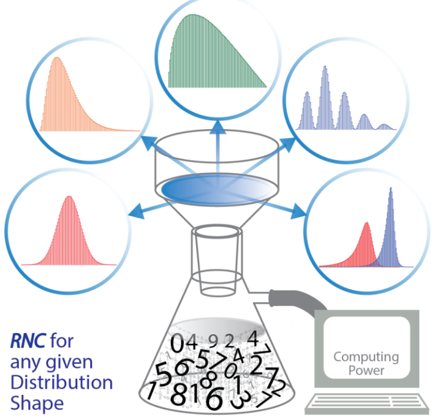

Molecules and materials often display distributed heterogeneous properties. Modeling the behavior of a single molecule with these properties (e.g. via Monte-Carlo simulations) requires a rapid way to sample distributions of interest and describe how they evolve. Here, we pedagogically introduce a simple algorithm that converts evenly distributed random number generator outputs to any defined probability density function (PDF) called the Random Number Converter (RNC). We demonstrate a numerical approach to obtain cumulative distribution functions (CDFs) and utilize a binary search algorithm to circumvent the need for analytical inverse CDFs. This simple method is demonstrated for various distributions, including single-exponential and Gaussian distributions and non-standard PDFs, for which neither the CDF nor its inverse are analytically solvable. We then apply this algorithm to the rate analysis of catalytic turnover cycles and Fourier spectroscopy, enabling the study of complex reaction kinetics and retrospective interferometry analysis. Our algorithm and examples can be used to train undergraduates on the tools that underlay Monte Carlo methods and connect physical chemistry to standard computer science and statistics. We provide a MATLAB and Python module in the Supporting Information with customizable parameters.

# Reference

Li B (Yangtao), Duong T, Neuhauser D, Alexandrova AN, Caram JR., ChemRxiv, 2024; [10.26434/chemrxiv-2024-4thlz-v2](https://doi.org/10.26434/chemrxiv-2024-4thlz-v2)

This content is a preprint and has not been peer-reviewed.

