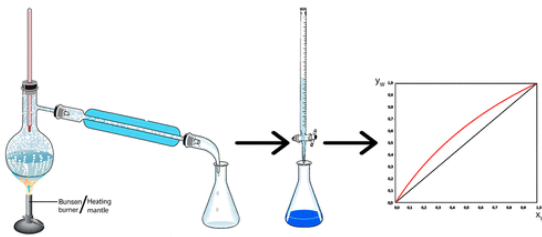

The activity proposed in this study aims to investigate the equilibrium between the liquid and vapor phases in a mixture of water and acetic acid, both of which are volatile substances. Students can easily determine the composition of the liquid phase and its corresponding vapor phase at equilibrium using a simple and conceptually clear method. This procedure allows for the construction of an x/y diagram that illustrates the trend of the compositions of the two phases at equilibrium. This experiment is performed at normal atmospheric pressure and requires no special equipment. It can be completed in a short 2&nbsp;h laboratory session. Students then spend 3&nbsp;h processing the experimental data. The results are then compared with theoretical values obtained using the Raoult–Dalton equation, combined with Antoine&rsquo;s or Clausius–Clapeyron&rsquo;s equation, and closely match the expected literature values.

# Reference

Patricia Prodan, Matteo Neffat, and Renato Bonomi, Journal of Chemical Education, [doi.org/10.1021/acs.jchemed.3c01285](https://doi.org/10.1021/acs.jchemed.3c01285)

