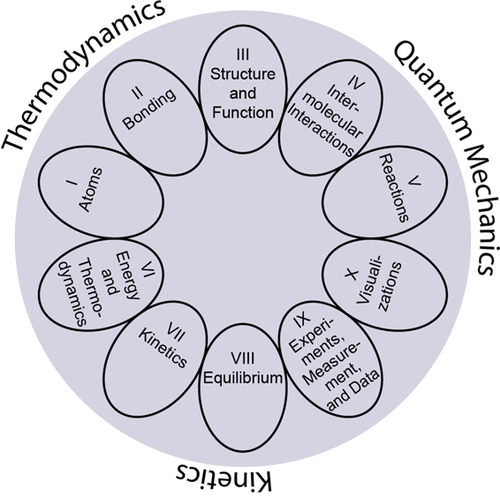

The ACS Examinations Institute has been developing Anchoring Concepts
Content Maps to provide an organizational template for the four-year
undergraduate chemistry curriculum. In order to accomplish this goal,
specific subdisciplinary versions of the map share the two top levels
but distinguish themselves at the bottom two levels which contain
finer-grained content details. This structure has been refined and
vetted over a number of meetings and workshops. This paper presents
the four levels of the content map for physical chemistry.

# Reference

Thomas A. Holme, Jessica J. Reed, Jeffrey R. Raker, and Kristen L. Murphy
Journal of Chemical Education 2018 95 (2), 238-241
[DOI 10.1021/acs.jchemed.7b00531](https://doi.org/10.1021/acs.jchemed.7b00531)

KEYWORDS: Upper-Division Undergraduate Physical Chemistry Testing/Assessment Curriculum

