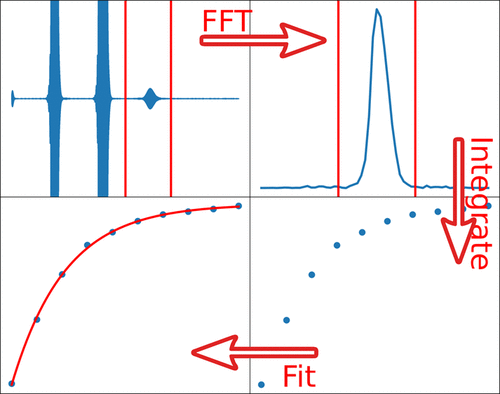

We describe an update to an experiment demonstrating low-field NMR
spectroscopy in the undergraduate physical chemistry laboratory. A
Python-based data processing and analysis protocol is developed for
this experiment. The Python language is used in fillable worksheets in
the notebook software JupyterLab, providing an interactive means for
students to work with the measured data step by step. The protocol
teaches methods for the analysis of large data sets in science or
engineering, a topic that is absent from traditional chemistry
curricula. Python is among the most widely used modern tools for data
analysis. In addition, its open-source nature reduces the barriers for
adoption in an educational laboratory.

# Reference

Zefan Zhang, Anshul Gautam, Soon-Mi Lim, and Christian Hilty,
Journal of Chemical Education Article ASAP

[DOI 10.1021/acs.jchemed.3c00586](https://doi.org/10.1021/acs.jchemed.3c00586)
KEYWORDS: Upper-Division Undergraduate, Physical Chemistry, Inquiry-Based/Discovery Learning, Computer-Based Learning, NMR

