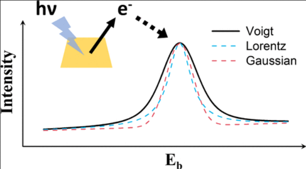

An integrated laboratory experience in X-ray photoelectron spectroscopy (XPS) is designed for undergraduate and graduate students in chemistry, materials science, and other related fields. Focusing on ubiquitous Si, Cu, and their common oxides, students are guided to characterize a series of standard materials by XPS to understand the fundamentals of this technique and practice spectral line identification and peak fitting skills. With synthesized SiOx and CuOx as the XPS samples, students are trained on the qualitative component identification strategies, and further, an optimized method for the quantitative analysis of Cu/CuOx components based on XPS peak deconvolution is introduced. This educational laboratory, which has been successfully implemented as part of a laboratory class at Stanford University, aims to equip students with insightful understandings of the XPS technique as well as practical operation skills on the synthesis of nanomaterials, XPS characterizations, and corresponding data analysis methodologies.

# Reference

Jiachen Li, Guanzhou Zhu, Peng Liang, and Hongjie Dai,
Journal of Chemical Education Article ASAP,
[DOI: 10.1021/acs.jchemed.3c00848](https://doi.org/10.1021/acs.jchemed.3c00848)

