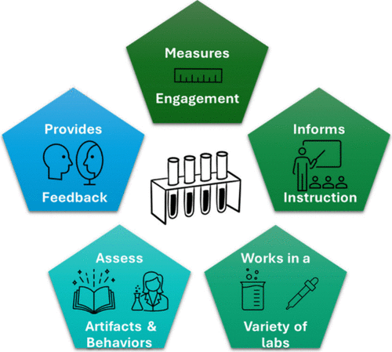

An undergraduate chemistry laboratory should serve as a space where students learn how to do chemistry. Laboratory time should not be used primarily to reinforce content knowledge but rather to develop essential competencies, including scientific practices. To support the acquisition of these competencies, students must be provided with meaningful opportunities to engage with scientific practices, and assessments must explicitly evaluate these practices, given the critical role assessment plays in shaping student learning. This article outlines several challenges associated with fostering engagement with scientific practices in laboratory settings, reviews existing assessment tools and their limitations, and proposes approaches to address some of these issues. We argue that there is a need for flexible assessment approaches, applicable across a range of undergraduate chemistry laboratory contexts. Properly designed assessment tools can also serve as practical guides for instructors seeking to make the laboratory a space primarily dedicated to skill development.

# Reference

Vinay Bapu Ramesh, Michael K. Seery, Renee Cole, *J. Chem. Educ.*, 2025, [doi.org/10.1021/acs.jchemed.5c00988](https://doi.org/10.1021/acs.jchemed.5c00988) 

