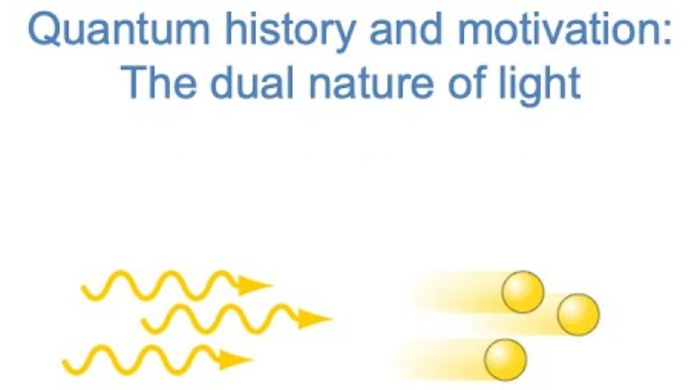

# Implementation

These course materials were designed by [Rob Berger](mailto:bergerr@wwu.edu) for flipped-classroom implementation of undergraduate quantum chemistry course at Western Washington University.

Rob covers quantum for ~11 weeks and stat/mech thermo for ~9 weeks, combining for two 10-week quarters. Students take quantum first, so the stat mech coverage assumes some familiarity with quantum models. (There is also a third quarter of p-chem at WWU that mainly covers equilibrium and kinetics, but Rob’s materials for that course are not yet as extensive.)

Typically, students watch about two videos per week, depending how content-rich the videos are. In class, there is usually a brief recap of key points in each video with opportunities for students to ask questions, followed by in-class group problem-solving activities or the above computer simulation activities. The in-class problem sets are not included here, but Rob would be happy to discuss and/or share those, too.

# Quantum Mechanics {.unnumbered}

## Big idea #1

Quantum mechanics explains light/matter interactions and
the behavior of small objects more effectively than classical
mechanics. Quantum mechanics is fundamentally different from classical
mechanics in that the state of an object is described by a
wavefunction, not just vectors.

:::{.column-margin}

Quantum mini-lecture playlist
:::

### Learning Targets {.unnumbered}

1.  At the beginning of the 20th century, matter was seen as consisting of particles, and light was seen as consisting of waves.
    
    ::: {.callout-note appearance="default" collapse=false}
    # Sample Success Criteria
    
    Given the wavelength or frequency of an electromagnetic wave, find the other. Identify which region of the electromagnetic spectrum the wave is in.
    :::
2.  In order to explain experiments&#x2014;the behavior of blackbodies, the photoelectric effect, and the emission spectra of atoms&#x2014;light, in addition to being wave-like, is also appropriately viewed as packets of energy called photons.
    
    ::: {.callout-note collapse=false}
    ## Sample Sucess Criteria
    - Explain how the concept of quantized energy rationalizes the behavior of blackbodies.
    - Given the workfunction of a metal and the wavelength of an incoming photon, predict whether electrons are ejected from the surface of the metal, and if so, what their speed is.
    - Given a wavelength of light emitted by an atom, find the energy difference between two orbits in the Bohr model of the atom.
    :::

3.  In order to explain other experiments (e.g., electron diffraction), matter at the small scale should also be seen as having a particle/wave duality.
    
    ::: {.callout-note collapse=false}
    # Sample success criteria
    Use the de Broglie relation to explain which types of objects---heavy or light---have a large wavelength (i.e., significant uncertainty in their position).
    :::

4.  Because matter is inherently wave-like, classical mechanics is incomplete. In the more complete set of rules (quantum mechanics), the position and momentum of an object are described by a wavefunction. The probability of finding an object at a given point is proportional to the square of its wavefunction.
    
    ::: {.callout-note collapse=false}
    # Sample success criteria
    - Normalize a given wavefunction, and find the probability that its position will be measured in a specified region of space.
    - Describe what it physically means for a wavefunction to have a node, and how this contradicts our intuition of how objects move around in space.
    :::

## Big idea #2

Every observable property (position, momentum, energy, etc.) corresponds to a mathematical operator, and the possible outcomes of a measurement are the eigenvalues of that operator. The eventual outcome can be predicted only in terms of probabilities.

### Learning targets

1.  For an operator $\hat{A}$, the eigenfunctions 𝜓 and eigenvalues a are the functions and values that satisfy the equation 𝐴̂𝜓 = 𝑎𝜓.
    
    ::: {.callout-note collapse=true}
    # Sample success criteria
    For a given operator 𝐴̂, determine whether a function 𝜓 is an eigenfunction of 𝐴̂. If so, find the corresponding eigenvalue.
    :::

2.  Every observable property (position, momentum, energy, etc.) corresponds to a mathematical operator. (The energy operator is called the Hamiltonian operator.) Possible outcomes of a measurement are the eigenvalues of that operator.
    
    ::: {.callout-note collapse=true}
    # Sample success criteria
    - Recognize common quantum mechanical operators (position, momentum, energy).
    - Given the numerical eigenvalues of an operator, predict the possible values of a measurement of the corresponding property.
    :::

3.  If the wavefunction 𝜓 is already an eigenfunction of a given property, the result of a measurement of that property is (with 100% probability) the eigenvalue corresponding to 𝜓.
    
    ::: {.callout-note collapse=true}
    # Sample success criteria:
    For a property corresponding to operator 𝐴̂, predict the outcome when that property is measured for an object in wavefunction 𝜓 (which happens to be an eigenfunction of 𝐴̂).
    :::

4.  If the wavefunction 𝜓 is not an eigenfunction of a given property, the possible results of a measurement of that property (predictable only in terms of probability) are the eigenvalues corresponding to the eigenfunctions that comprise 𝜓. The process of measurement causes 𝜓 to collapse to an eigenfunction.  
    
    ::: {.callout-note collapse=true}
    # Sample success criteria:
    If told that wavefunction 𝜓 is a sum of eigenfunctions, (𝜓 = 𝑎𝜓𝑎 + 𝑏𝜓𝑏 + ⋯), predict the possible outcomes of a measurement and their respective probabilities. Describe what happens to 𝜓 when the property is measured.
    :::

1.  If set of rules carries surprising implications. Measurement in quantum mechanics changes the state of an object, and certain pairs of properties cannot be known simultaneously.
    
    ::: {.callout-note collapse=true}
    # Sample success criteria
    Calculate the commutator of two properties (e.g., position and momentum), and describe the physical implications of the result.
    :::

See the [Downloads](#downloads) section below for complete course materials.

# Thermodynamics, Stat Mech, Kinetics

## Big idea #1

:::{.column-margin}

Thermo, Stat M., Kinetics mini-lecture playlist
:::

For a set of quantized energy states, Boltzmann factors determine the occupation probabilities of each state, which in turn dictate macroscopic properties.

### Learning Targets

1.  The Boltzmann factor $(e^{-\epsilon/k_BT})$ is proportional to the probability that a quantized energy state will be occupied at a given temperature. The partition function (q) is a sum of all Boltzmann factors of a system.
    
    ::: {.callout-note collapse=true}
    # Sample success criteria:
      - Qualitatively describe how raising the temperature or increasing the spacing between states changes the probability that excited states will be populated.
      - For a given set of states at a given temperature, calculate the partition function and the probabilities that each state will be occupied.
    :::

2.  The inherent distinguishability or indistinguishability of the particles affects how multi-particle states are counted, and consequently affects their occupation probabilities.
    
    ::: {.callout-note collapse=true}
    # Sample success criteria:
    - For a system with a small number of states and particles, write the exact partition functions (Q) for distinguishable particles, indistinguishable bosons, and indistinguishable fermions. In each case, calculate the probability that each multi-particle state will be occupied.
    - For a system with many unoccupied states, explain how and why to make a reasonable approximation for the partition function of bosons or fermions.
    :::

3.  Macroscopic properties, such as the average energy and heat capacity of a system, can be expressed in terms of the partition function.
    
    ::: {.callout-note collapse=true}
    # Sample success criteria
      Given the expression for average energy in terms of partition function (which you do not have to memorize), calculate the average energy and heat capacity of a system.
    :::

4.  Diatomic and polyatomic molecules can be viewed as having independent sets of translational, vibrational, rotational, and electronic energy states. The partition functions of such molecules, and therefore their macroscopic properties, can be estimated based on quantum model systems.
    
    ::: {.callout-note collapse=true}
    # Sample success criteria
       - Rank the components of a molecule’s partition function (translational, vibrational, rotational, electronic) from smallest to largest.
       - State which quantum model system is used to approximate each component of a molecule’s energy. Understand where the derivations of each component of the energy and heat capacity are coming from (though you don’t need to remember every step).
       - Explain in words the meaning of a diatomic molecule’s vibrational temperature (Θvib ) and rotational temperature (Θrot).
       - Given values of Θvib or Θrot, calculate the fractional population of each vibrational or rotational energy level at a given temperature. Given two diatomic molecules, predict which has a larger Θvib or Θrot.
       -  Predict the molar constant-volume heat capacities of diatomic and polyatomic molecules using simple assumptions (e.g., a temperature too low to excite vibrational modes, or high enough to excite all vibrational modes).
    :::

5.  The macroscopic behavior of ideal gases is governed by the ideal gas law (𝑃𝑉 = 𝑛𝑅𝑇), which follows from statistical mechanics. Real gases are influenced by the size of and forces among atoms and molecules.
    
    ::: {.callout-note collapse=true}
    # Sample success criteria
      - Use the ideal gas law to calculate basic relationships among the macroscopic properties of an ideal gas (e.g., pressure, volume, temperature, molar mass, and density).
      - Recognize that temperature is proportional to the kinetic energy of an ideal gas, and use that fact to compare the average speeds of different gases.
      - Explain the intuitive meaning of the empirical parameters a and b in the van der Waals equation, which relates the macroscopic properties of a real gas.
      - Understand how supercriticality arises from the size and attractive forces of a real gas. Recognize the differences among a gas, a liquid, and supercritical fluid in a pressure-volume diagram.
    :::

See the [Downloads](#downloads) section below for complete course materials.

# Downloads

Each PDF file contains Big Ideas, Learning Targets, and Sample Success Criteria.

-   [Learning Progressions for Quantum Mechanics](Rob Berger Quantum learning progressions.pdf) and associated [YouTube Quantum playlist](https://youtube.com/playlist?list=PLQBZe6QwlRssHCxYHI5xFIOCk_TGktZVk)

-   [Thermo, Stat Mech, and Kinetics](Rob Berger Thermo learning progressions.pdf) and [YouTube playlist Thermo, Stat Mech, and Kinetics](https://www.youtube.com/playlist?list=PLQBZe6QwlRsu7UPYCaGVvzPXHT6LlYh8W)

# Author

Rob Berger, bergerr@wwu.edu,  <https://wp.wwu.edu/bergerr/teaching/>

# License

Unknown

