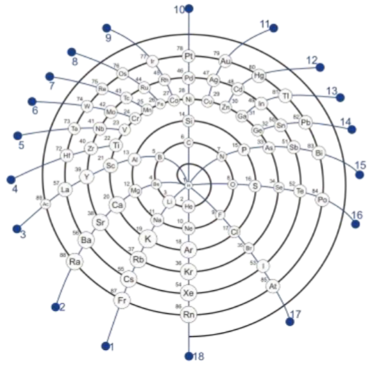

Scope: I introduce a reproducible, closed-surface mapping of the periodic system onto a sphere with a single equatorial ring, yielding a symmetric alternative to 2D layouts. The construction partitions the sphere into belts that match the cardinalities of the s/p/d/f blocks (2/6/10/14), places lanthanoids and actinoids on a continuous “f-ring,” and defines groups as meridians and periods as concentric shells. A compact parameterization provides Cartesian coordinates (x,y,z) (x,y,z) for all 118 elements, enabling property overlays without changing geometry. Methods: On the fixed spherical layout, I quantify periodic trends using four diagnostics: (i) local smoothness via geodesic k-nearest-neighbour mean absolute difference (kNN-MAD) for first ionization energy, Pauling electronegativity, and covalent radius; (ii) azimuthal gradients along constant-θ rings (block×period) using central differences, reported per step and per radian; (iii) ring-level monotonicity via Spearman’s ρ between azimuthal order and property ranks; and (iv) cross-shell group coherence as the within-group standard deviation across periods. Real property values are compiled primarily from NIST (ionization energies) and complemented by standard compilations for EN (Pauling scale) and covalent radii (Cordero et al., 2008). Findings: Across all three properties, the spherical–ring manifold recovers expected periodic structure: smooth azimuthal progressions along many p-block rings, coherent meridians for several groups across shells, and clear, localized departures where chemistry is known to deviate from simple trends. The same patches recur across diagnostics, indicating genuine signals rather than plotting artefacts. Because the geometry is invariant, different properties can be overlaid on an identical canvas (only color/size change), facilitating side-by-side comparisons. Significance: The spherical–ring representation reframes periodicity from an arrangement problem into a geometric, testable structure. It provides a neutral canvas on which periodic trends, anomalies, and cross-property correspondences become quantifiable. This, in turn, supports new hypothesis generation about where periodic regularities are robust and where deeper theoretical or experimental scrutiny is likely to be most informative.

# Reference

Zikl P. ChemRxiv. 2025; [doi:10.26434/chemrxiv-2025-5jvdj](https://doi.org/10.26434/chemrxiv-2025-5jvdj). This content is a preprint and has not been peer-reviewed.

