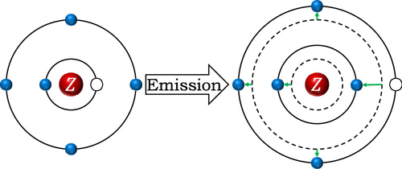

This study aims to give chemistry students a deeper understanding of electron shielding and quantum transitions by interpreting the characteristic X-ray lines. There is a popular misunderstanding among learners and even teachers in which an outer-shell electron fills a vacancy in the inner shell, releasing some of its energy as an X-ray photon. However, this picture gives an unsatisfactory prediction of characteristic X-ray lines. In fact, electron transition is a collective process. During the transition of one electron, the states of all of the electrons in the system change together due to the change in shielding between the electrons. By using the effective nuclear charges calculated with Slater’s rules, formulas for Kα lines are derived, which fit experimental data very well. The formulas are also compared to Moseley’s law to explain its success and limitations. The introduction of the ideas and methods and the students’ research projects significantly improve the understanding of the concepts related to atomic structure, quantum states, and quantum transition and the students’ problem-solving skills.

# Reference

Ruifeng Zhou,
Journal of Chemical Education Article ASAP,  [doi:10.1021/acs.jchemed.4c00396](https://doi.org/10.1021/acs.jchemed.4c00396)

