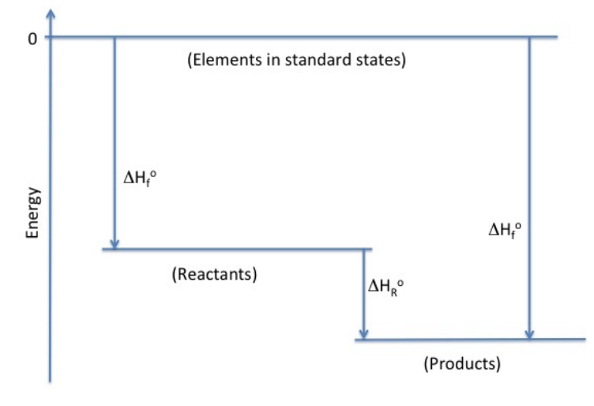

# What is this experiment about?

Many chemical systems, such as the thermal decomposition of hydrofluorocarbons, are not easily accessible experimentally, and certainly not in the physical chemistry lab course. Students work with computational chemistry to evaluate approaches that will provide reasonable results in a reasonable time for the thermochemistry of fluoropropane decomposition. They explore the tradeoff of computational accuracy against the cost of performing the calculations. Students also use the information available from the calculations to obtain thermochemical quantities and evaluate the different fluoropropanes.

# What do students do?

Pre-experiment work focuses on the structure of fluoropropanes and the thermodynamics of the decomposition into an ethene and HF. In the first cycle, students perform computations on small molecules and analyze the output for electronic energy, vibrational frequency, and heat capacity. That motivates the second cycle where teams examine multiple basis set/method combinations, compare to existing computational and experimental data, and develop a rationale for using a particular basis set/method combination for fluoropropane calculations. The final cycle has students do those calculations for all the fluoropropanes and decomposition products, with a focus on reaction energies and heat capacities. They use that information to draw conclusions about balancing the fire suppression ability of a fluoropropane against its propensity to decompose into HF.

# What equipment and supplies will you need?

Calculations can be done on [ChemCompute](https://chemcompute.org/) or a package of the instructor’s choice. A spreadsheet template is available that allows student teams to enter their results in a way that permits straightforward comparisons among the molecules. 

# What makes this experiment a physical chemistry experiment?

Computational chemistry has found its way into many experimental research articles as well as being a focus of research on its own. This experiment has students investigate considerations for making good choices about how to perform those calculations in ways that can support experimental decisions and analysis. The experiment further makes direct connections to an important application–fire suppression systems that use fluoropopanes–demonstrating the significance of physical chemistry approaches.

# And what makes it a POGIL-PCL experiment?

Students make predictions at several points in the experiment, in particular identifying which fluoropropane might be a good choice for a fire suppressant. They support their predictions with hypotheses developed from the application of computational models. Student teams interact to select a basis set/method combination for all calculations and share data about the numerous fluoropopanes that can be studied. They develop a variety of visual and graphical representations, such as Hess’s Law diagrams, to process the information from the calculations. Through making a case for their chosen fluoropropane, students demonstrate understanding of the complex concepts undergirding electronic structure calculations.

# Reference

Reeves, M. S., Berghout, H. L., Perri, M. J., Singleton, S. M., & Whitnell, R. M., 2019, &ldquo;How Can You Measure a Reaction Enthalpy without Going into the Lab?&rdquo; *Using Computational Methods To Teach Chemical Principles*, 51–63,  <https://doi.org/10.1021/bk-2019-1312.ch005>

[View student version](https://chemistry.coe.edu/piper/pclform.html?expt=measureEnthalpy)

The Instructor’s Handbook with implementation details, sample data, and expected answers is available through the [POGIL-PCL project](https://www.pogilpcl.org/get-connected). 

Highlight author: Rob Whitnell

