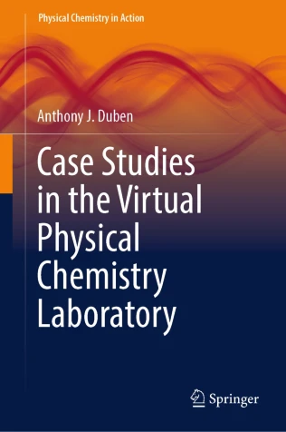

Publisher&rsquo;s description: This textbook provides a unique instructional resource in experimental Physical Chemistry with case studies based on data taken from the scientific literature. Platform-independent software that generates individualized data sets for student practice and assessment is included. Case Studies in the Virtual Physical Laboratory can be used to

-   Create online virtual laboratory courses in Physical Chemistry.
-   Supplement instruction in the lecture hall.
-   Complement hands-on projects in face-to-face laboratory courses.

The case studies cover states of matter, thermochemistry, phase equilibria, reaction equilibria, chemical kinetics, electrolyte solutions, and activity coefficients. They are written to be self-contained to give flexibility in the choice of projects. The pedagogical approach in each case study is to use the given data in direct instruction followed by the analysis of the synthetic data as individualized tasks.  Only open-source software tools are needed to analyze data. Each case study contains a thorough discussion of the theoretical principles underlying the experiment and data, the character of the data to be analyzed, and methods appropriate for the analysis of the data. The accompanying software has been written to allow the production of many data sets without risking duplication, yet the synthetic data can be regenerated if the files are lost or become corrupted. Software programs were written in Fortran 95 and are distributed as a suite of executable programs for Intel-based computers running Windows, MacOS, or Linux. This book will be of particular interest and usefulness to students and instructors in upper-division undergraduate physical chemistry courses.

Chapters:

-   Critical Properties and Real Gases
-   Thermochemistry
-   Phase Equilibria
-   Reaction Equilibria
-   Electrolyte Solutions
-   Activity Coefficients
-   Chemical Kinetics

# Reference

Anthony J. Duben, Case Studies in the Virtual Physical Chemistry Laboratory, Springer Cham, 2024, [doi:10.1007/978-3-031-55018-8](https://doi.org/10.1007/978-3-031-55018-8)

