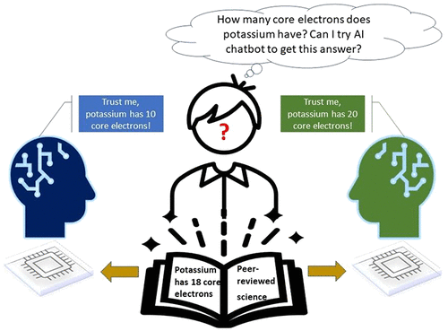

Artificial intelligence (AI) technology has the potential to revolutionize the education sector. This study sought to determine the efficacy of ChatGPT to correctly answer questions a learner would use and to elucidate how the AI was processing potential prompts. Our goal was to evaluate the role of prompt formats, response consistency, and reliability of ChatGPT responses. Analyzing prompt format, we see that the data do not demonstrate a statistically significant difference between multiple-choice and free-response questions. Neither format achieved scores higher than 37%, and testing at different locations did not improve scores. Interestingly, ChatGPT’s free version provides accurate responses to discipline-specific questions that contain information from unrelated topics as distractors, improving its accuracy over the free-response questions. It is important to consider, while ChatGPT can identify the correct answer within a given context, it may not be able to determine if the answer it selects is correct computationally or through analysis. The results of this study can guide future AI and ChatGPT training practices and implementations to ensure they are used to their fullest potential.

# Reference

Alfredo J. Leon and Dinesh Vidhani, Journal of Chemical Education Article ASAP

<https://doi.org/10.1021/acs.jchemed.3c00288>

KEYWORDS: Computer-Based Learning, Self-Instruction, Web-Based Learning Assessment, Student-Centered Learning

