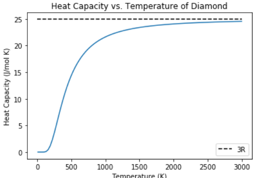

This one semester course demonstrates the molecular bases of chemical engineering, making the connection between basic physical chemistry concepts (Boltzmann statistics, classical and quantum mechanics) and the pillars of chemical engineering (thermodynamics, kinetics, and transport).

The course was taught using an online format due to COVID-19 pandemic concerns, Spring 2020.

Resources include:

-   Syllabus
-   How to succeed in physical chemistry
-   Course outline and notes
-   Example Jupyter notebook
-   Homework assignments and solutions
-   Exam solutions

# Location

<https://github.com/wmfschneider/CHE30324>

# Author

William F. Schneider, University of Notre Dame, College of Engineering

KEYWORDS:

