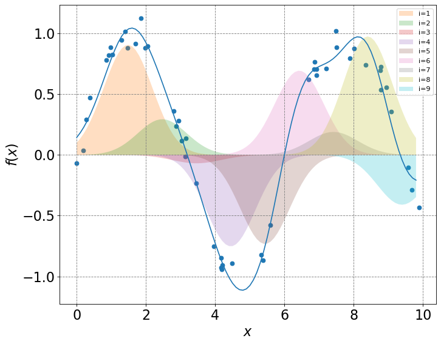

This book is a collection of lessons covering various topics in the undergraduate chemistry curriculum. Each lesson is made in a Jupyter Notebook so most of them include a combination of written notes, equations, plots, and python code. The code part, in particular, is meant to be interactive. This can be achieved by launching the notebook in google Colab via the button on the top.

The target audience for this book are undergraduate students, undergraduate chemistry instructors, and anybody else interested in using Jupyter Notebooks for chemistry instruction.
This book can be used either interactively or non-interactively. Each lesson within a topic is designed to be approximately a day&rsquo;s worth (50mins) of material.

Physical chemistry topics include:

-   Statistical Thermodynamics
-   Thermodynamics
-   Quantum Mechanics
-   Electronic Structure

Mathematical concepts for physical chemistry include:

-   Logarithms and exponential functions
-   Differentiation and critical points
-   Integration in 1D
-   Derivatives of multivariable functions
-   Discrete probability

# Reference

Martin McCullagh

<https://mccullaghlab.github.io/intro.html>

