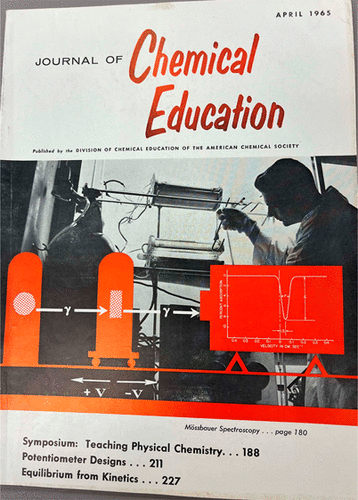

Physical chemistry may be a quintessential example of a multidisciplinary subfield for the study of chemistry. Although the extent to which mathematics and physics play a role in the theoretical and quantitative expression of chemistry has varied over the 100 years of the Journal, the symbiosis has always been present and the resulting collaborations, fruitful. This editorial introduces a virtual issue that tracks the development and current state of the teaching and learning of physical chemistry as expressed in a curated set of articles from the Journal, celebrating 100 years of publishing educational innovation in chemistry education. The virtual issue can be found here: <https://pubs.acs.org/page/jceda8/vi/JCE100yr-pchem>.

# Reference

Thomas Holme,
Journal of Chemical Education, 2023, 100 (9), 3165-3167

[DOI: 10.1021/acs.jchemed.3c00818](https://doi.org/10.1021/acs.jchemed.3c00818)

KEYWORDS: Physical Chemistry Examples, Physical Chemistry Curriculum, Physical Chemistry Laboratory Experience, Thermodynamics, Kinetics, Atomic and Molecular Structure, Spectroscopy

