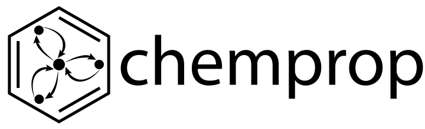

Chemprop is a PyTorch-based framework for training and evaluating message-passing neural networks (MPNNs) for molecular property prediction. Advancements in neural machinery have led to a wide range of algorithmic solutions for molecular property prediction. Two classes of models in particular have yielded promising results: neural networks applied to computed molecular fingerprints or expert-crafted descriptors and graph convolutional neural networks that construct a learned molecular representation by operating on the graph structure of the molecule. However, recent literature has yet to clearly determine which of these two methods is superior when generalizing to new chemical space. Furthermore, prior research has rarely examined these new models in industry research settings in comparison to existing employed models. Chemprop functionalities include support of multimolecule properties, reactions, atom/bond-level properties, and spectra. Various uncertainty quantification and calibration methods are incorporated with related metrics.

The repository contains documentation, tutorials, video and interactive materials from workshops, and example Jupyter notebooks.

# Reference

Github repository: [https://github.com/chemprop/chemprop](https://github.com/chemprop/chemprop)

Documentation: [https://chemprop.readthedocs.io/en/main/](https://chemprop.readthedocs.io/en/main/)

Kevin Yang, Kyle Swanson, Wengong Jin, Connor Coley, Philipp Eiden, Hua Gao, Angel Guzman-Perez, Timothy Hopper, Brian Kelley, Miriam Mathea, Andrew Palmer, Volker Settels, Tommi Jaakkola, Klavs Jensen, and Regina Barzilay. Analyzing learned molecular representations for property prediction. Journal of Chemical Information and Modeling, 59(8):3370–3388, 2019. PMID: 31361484. URL: <https://doi.org/10.1021/acs.jcim.9b00237>, arXiv:<https://doi.org/10.1021/acs.jcim.9b00237>, https://doi.org/10.1021/acs.jcim.9b00237.

Esther Heid, Kevin P. Greenman, Yunsie Chung, Shih-Cheng Li, David E. Graff, Florence H. Vermeire, Haoyang Wu, William H. Green, and Charles J. McGill. Chemprop: a machine learning package for chemical property prediction. Journal of Chemical Information and Modeling, 64(1):9–17, 2024. PMID: 38147829. URL: <https://doi.org/10.1021/acs.jcim.3c01250>, arXiv:<https://doi.org/10.1021/acs.jcim.3c01250>, https://doi.org/10.1021/acs.jcim.3c01250.

