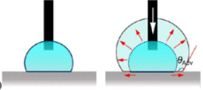

The purpose of this study was to enhance students’ understanding of surface wetting by exploring the relationship between contact angles and nanopatterned surface structures as part of the required course, “Chemistry in Nanoscience.” We developed a comprehensive three-part activity, combining theory, experiments, and modeling of surface wetting, for 30 sophomore students of the Department of Materials Science and Engineering who had finished gateway courses related to materials science and physical chemistry. In the first exercise, students dug into the theoretical foundations of surface wetting by deriving and interpreting Young’s, Wenzel’s, and Cassie–Baxter’s equations. The second exercise involved digital experiments wherein students observed changes in wetting properties on different nanopatterned surface structures via an online app. Finally, the third exercise presented a nanoscale model using a wetting parameter to enhance students’ understanding of surface wetting at the molecular level. Student learning outcome evaluations revealed that this hands-on integrative approach substantially improved students’ understanding of surface wetting concepts. Students obtained a comprehensive understanding of surface wetting by deriving wetting models, visualizing contact angle variations in digital experiments, and linking these to a nanoscale wetting parameter. Moreover, students expressed greater confidence and enthusiasm for tackling complex topics in surface science and research.

# Reference

Rong An, Ruizhe Zeng, Junsen Huang, Feng Xu, Haibo Zeng, Zhongyang Dai, Faiz Ullah Shah, Aatto Laaksonen, Si Lan, J. Chem. Educ. 2024, [doi.org/10.1021/acs.jchemed.4c00401](https://doi.org/10.1021/acs.jchemed.4c00401)

