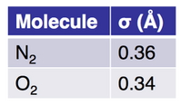

Rowley offers courses in physical and computational chemistry, and writes about teaching on his blog [Teaching Physical Chemistry](http://teachphyschem.blogspot.com/). Sample blog post titles include

-   Obviously Students Don&rsquo;t Read Course Outline (and what do to about it)
-   Including Climate Change Topics in Undergraduate Physical Chemistry
-   A Molecular Simulation Exercise of a Molecular Machine
-   How I improved my lectures after 6 years
-   Calling out students, but not in a mean way
-   Flipping Advanced Statistical Thermodynamics

**Media**

Molecular simulations are powerful visual aids for teaching chemical concepts and training researchers in simulation methods. The animations used for teaching are publicly available so that other instructors can use this material. This content can be viewed on the YouTube channel or downloaded from Wikimedia Commons.

# Location

Website: [www.rowleygroup.net/teaching](https://www.rowleygroup.net/teaching)

Blog: [teachphyschem.blogspot.com](http://teachphyschem.blogspot.com/)

YouTube: [www.youtube.com/@ChristopherRowleyChemistry](https://www.youtube.com/@ChristopherRowleyChemistry/)

# Author

Christopher Rowley, Department of Chemistry, Carleton University

