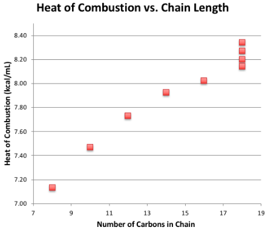

## What is this experiment about?

Students synthesize (optional) biodiesel from various feedstocks, consider the fatty acid composition of biodiesel based on the feedstock, and relate fatty acid methyl ester (FAME) structure to heat of combustion and viscosity. Students should be familiar with the concepts of enthalpy of combustion, bond enthalpy, and density.

## What do students do?

Different groups of students choose different feedstocks (olive oil, soybean oil, coconut oil, etc.) to use to synthesize biodiesel (optional), and then measure the heat of combustion with a bomb calorimeter. For heat of combustion data for FAMES (provided), students graphically determine the relationship between degree of unsaturation and heat of combustion and chain length and heat of combustion; for this process, they need to consider and decide upon the best unit to use so that they can make comparisons to their biodiesel data. Students also measure viscosity for their biodiesel as well as some FAMEs, at various temperatures so that the energy of viscosity can be determined from a linear plot. They then construct a plot to determine the relationship between chain length of the FAMEs and viscosity. The optional synthesis takes a 3-hour lab period; the rest requires two 3-hour lab periods.

## What equipment and supplies will you need?

-   Bomb calorimeter (though data is provided in the instructor’s materials if needed)
-   Viscometer (more specific information about viscometer size is provided in the instructor’s handbook)
-   Feedstocks (olive oil, soybean oil, etc.), and FAME samples (optional; data is provided for these)

The synthesis requires, for each group, a 250-mL three-necked round-bottomed flask equipped with a condenser, ground-glass stopper, a thermometer assembly, and hotplate/magnetic stirrer. As well as NaOH, methanol, 0.15 M acetic acid, and MgSO4.

## What makes this experiment a physical chemistry experiment?

This experiment focuses the concepts of heat of combustion and viscosity, relating them to structure.

## And what makes it a POGIL-PCL experiment?

Each group uses a different biodiesel sample (made from a different feedstock), and the class shares data. Based on a consideration of the FAME composition of the feedstock and FAME structure, students predict the heat of combustion of various biodiesel samples and FAMES. Students also predict FAME viscosity. Students need to think about what data to collect (for viscosity determination) and what units to use for their data. They make several graphs to determine relationships, as well as to fit data to a linear equation and extract parameters. Based on the data collected, students consider which feedstock may make the best biodiesel fuel for a hot climate, and which would be best for a cold climate.

# Reference

Diane Miller, Seton Hill University

[View the student version](https://chemistry.coe.edu/piper/pclform.html?expt=biodiesel)

The Instructor’s Handbook with implementation details, sample data, and expected answers is available through the [POGIL-PCL project](https://www.pogilpcl.org/get-connected). 

