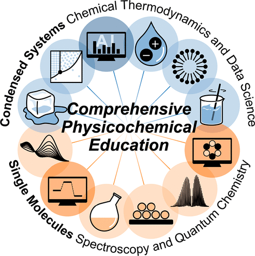

The COVID-19 pandemic has led to an increasing amount of research on redesigning educational models. This paper describes the contents of a new laboratory course on physical chemistry based on blended learning, designed for third-year students in the Department of Applied Chemistry, Faculty of Science and Engineering, Chuo University. We provided students with digest video materials for flipped learning, a cloud computing environment, and video conferencing tools. These materials enhanced the course contents to facilitate effective education during the pandemic. The results of a questionnaire survey showed that students were delighted with the new course, which comprehensively included experiments, computation, and data science.

The new course content has been restructured to conform to well-known textbooks. It includes the concepts of phase equilibria, buffers, titration, intermolecular interactions, spectroscopy, solutions, coordination chemistry, and kinetics. These contents correspond to our textbook chapters &ldquo;Condensed Systems Study by Chemical Thermodynamics and Data Science&rdquo;, and &ldquo;Single Molecules Study by Spectroscopy and Quantum Chemistry&rdquo;. Traditionally, each of the contents have been taught almost independently with fewer relationships. However, in our proposed 12-module system, nine experimental contents are connected by three modern computer-related contents, as shown in the figure.

# Reference

Nahoko Kuroki and Hirotoshi Mori,
*Journal of Chemical Education*, 2021, 98 (12), 3864-3870,
[DOI: 10.1021/acs.jchemed.1c00666](https://doi.org/10.1021/acs.jchemed.1c00666)

Upper-Division Undergraduate, Physical Chemistry, Computational Chemistry, Equilibrium, Spectroscopy, Thermodynamics, Computer-Based Learning, Internet/Web-Based Learning

