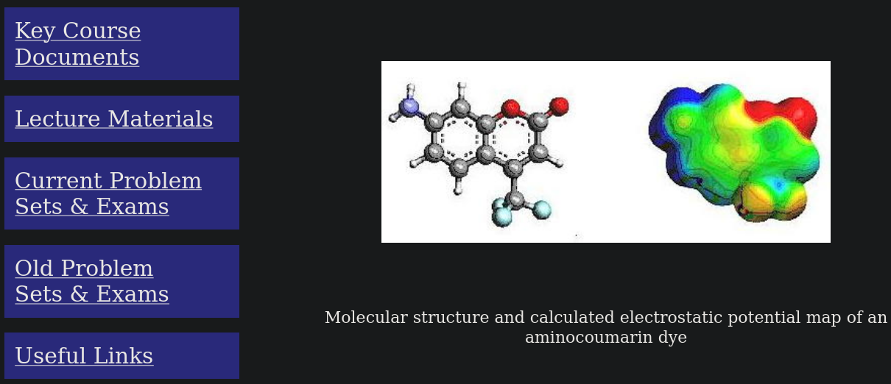

Spring Semester 2014 Course Summary: Modern theoretical methods used in study of molecular structure, bonding, and reactivity. Concepts and practical applications. Semiempirical, ab initio, and density functional calculations of molecular electronic structure. Theoretical determination of molecular structure and spectra; relationship to experimental techniques. Molecular mechanics. Structure determination of large systems. Study of molecular properties and reactivity by theoretical methods. Computational tools for theoretical determination and lab for hands-on experience. Critical assessment of reliability of methods and theoretical work in literature.

Course Outline:

1.  Introduction and Historical Perspectives and Generalities
2.  Force Fields / Molecular Mechanics
3.  Semiempirical Theory
4.  Ab Initio Hartree-Fock Theory
5.  Density Functional Theory
6.  Condensed-phase Calculations
7.  Advanced Topics

Materials include syllabus, lecture materials (slides, videos, notes), problem sets, and old exams.

[CHEM4021/8021 Course Page](http://pollux.chem.umn.edu/8021/)

[YouTube video playlist](https://www.youtube.com/watch?v=pu4uL7deCNw&list=PLkNVwyLvX_TFBLHCvApmvafqqQUHb6JwF)

[Internet Archive link](https://web.archive.org/web/20210413050106/http://pollux.chem.umn.edu/8021/)

# Author

Chris Cramer, Department of Chemistry, University of Minnesota

KEYWORDS: physical chemistry teaching learning, computational chemistry, course

