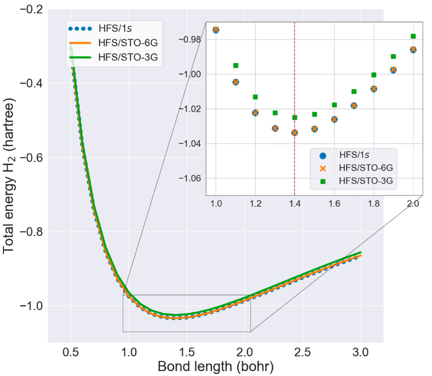

As a widely applied theory that has found success across many fields, density functional theory (DFT) is largely taught. Typically, the most effective way to convey DFT concepts is through illustrative examples that are currently lacking in available resources. In this work, we demonstrate total energy calculations for H2 using 1s Slater type orbitals (STOs) within the framework of DFT. The molecular orbitals are constructed from a linear combination of 1s STOs centered on each atom. Using the Kohn–Sham equation, an equivalent expression for total energy, based on Kohn–Sham orbital eigenvalues, is given, aligning with that of the Hartree–Fock method. Detailed evaluations of Slater and X-Alpha exchange energies are presented along with a plotted potential energy surface and variations in density. Comparison with STO-nG basis sets not only supports the current work but also demonstrates the superiority of 1s STO over them. These features are included in the H2 Jupyter Notebook which is freely accessible at <https://github.com/choirunnr/dft-h2-1s>. Additionally, the H2 Jupyter Notebook was assessed for its implementation, receiving largely positive responses. Consequently, this work offers a valuable complement to existing teaching resources and strategy.

# Reference

Choirun Nisaa Rangkuti, Suci Faniandari, A Suparmi, and Yanoar Pribadi Sarwono,
Journal of Chemical Education Article ASAP 2023.

[DOI: 10.1021/acs.jchemed.3c00931](https://doi.org/10.1021/acs.jchemed.3c00931)

