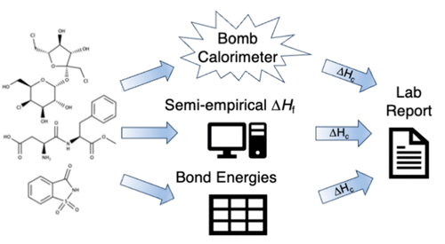

In this laboratory activity, students were tasked with determining the heat of combustion for each of three common sugar substitutes: saccharin, aspartame, and sucralose. The heats of combustion were determined via three different methods: bomb calorimetry, heats of formation derived from semiempirical calculations, and tabulated average bond energies. Students were then tasked with writing a single laboratory report that combined and compared the results obtained from all three techniques. This gave them an experience more representative of writing a journal article than traditional laboratory reports that typically focused on outcomes from a single laboratory technique. The results from the two theoretical methods were compared via percent error and error analysis with the experimentally determined results. The comparison of the experimentally determined heats of combustion and the semiempirically derived heats of combustion all yielded errors of less than about 20%, while the comparisons of the experimentally determined heats of combustion and the bond-energy-derived heats of combustion yielded errors of 20&#x2014;50%. In addition to the experience with writing the more complex laboratory report, students gained experience working with process hazards that involved elevated and changing gas pressure, performing computational calculations, and applying skills learned in previous chemistry courses. This laboratory activity is presented so that it will allow adoption by others, including student handouts for the bomb calorimetry and theoretical determination activities and notes for the instructor.

# Reference

Andrea D. Merry, John A. Means, and Tim E. Hall, J. Chem. Ed., 2024,
[doi:10.1021/acs.jchemed.3c00691](https://doi.org/10.1021/acs.jchemed.3c00691)

