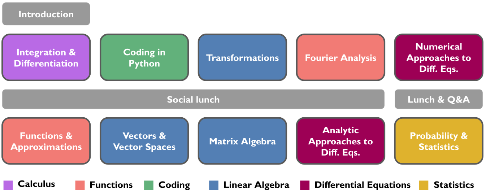

A student-led mathematics bootcamp has been designed and implemented to help foster community building, improve confidence in mathematical skills, and provide mathematical resources for incoming physical chemistry doctoral students. The bootcamp is held immediately before the start of the first semester of graduate school and uses an active learning approach to review and practice undergraduate-level mathematics problems over five days in small student groups. This work includes the development and presentation of a new, publicly available mathematics curriculum for the bootcamp on select mathematics topics, including calculus, linear algebra, functions, differential equations, statistics and coding in Python, aiming at improving students&rsquo; confidence and learning experiences in graduate quantum mechanics and statistical physics courses. Surveys before and after the bootcamp showed an increase in students&rsquo; confidence in problem-solving in key mathematical areas and in social aspects of peer-led group learning. Qualitative and quantitative analysis demonstrates that the bootcamp reduced prior inequities in students&rsquo; confidence metrics based on gender and mathematical background.

# Reference

Clune R, Das A, Jasrasaria D, Rossomme E, Cohen O, Baranger AM. Development of a week-long mathematics intervention for incoming chemistry graduate students. ChemRxiv. Cambridge: Cambridge Open Engage; 2023; This content is a preprint and has not been peer-reviewed. [doi.org/10.26434/chemrxiv-2022-dl84f-v2](https://doi.org/10.26434/chemrxiv-2022-dl84f-v2)

Website for the mathematics bootcamp containing information on current instructors and instructional content: <https://chemmathbootcamp.com/> 

