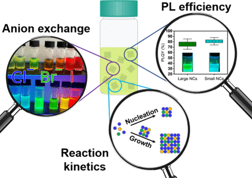

A room temperature synthesis of CsPbBr3 quantum dots is presented as an accessible laboratory platform for teaching core concepts in nanomaterials and colloidal synthesis to undergraduate chemistry students. The described syntheses produces highly luminescent nanocrystals (photoluminescence quantum yields of 80–90%) with narrow excitonic absorption and luminescence features. Tri-n-octylphosphine oxide and dialkylphosphinate surfactant ligands are used to achieve slow nucleation and growth kinetics, enabling *in situ* monitoring of the nanocrystal size evolution by using absorption or luminescence spectroscopy with conventional laboratory instrumentation. Nucleation kinetics extracted from the absorption spectra during growth are used to illustrate contemporary models of crystal size control and polydispersity in colloidal crystallizations.

# Reference

Yuzuka Karube, Rodolphe Valleix, Lilian Guillemeney, Carlos Johnson, Courtney Stone, Jonathan S. Owen, *J. Chem. Educ.*, 2026, [doi.org/10.1021/acs.jchemed.5c01361](https://doi.org/10.1021/acs.jchemed.5c01361)

