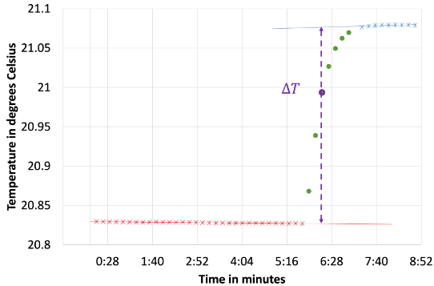

# What is this experiment about?

Soluble ionic compounds produce ions when they dissociate in water and this process may absorb or release thermal energy. In this experiment students measure the temperature change upon dissolution of  ionic compounds. They calculate the heat absorbed or released and then relate it to the molar solution enthalpy of the ionic compound. In this experiment, students learn the method of solution calorimetry and use it to measure solution enthalpies. Students use their measured solution enthalpies and the Born-Mayer equation as a model to calculate lattice enthalpies, which exhibit periodic trends. Any introduction to calorimetry in previous lab courses is sufficient for this experiment.

# What do students do?

Students use a coffee-cup calorimeter, and/or a more advanced solution calorimeter, to observe temperature changes when a salt dissolves in water. Students construct thermograms and calibrate their calorimeter to determine solution enthalpies for salts of monatomic ions. Students use the Born-Mayer equation as a model to construct lattice enthalpies that exhibit periodic trends. Students then explore, interpret, and consider extending periodic trends in lattice enthalpies of monatomic ions.

# What equipment and supplies will you need?

-   Coffee-cup calorimeter consisting of a styrofoam coffee-cup, magnetic stirrer, and thermometer, or a dedicated solution calorimeter, with analytical balances recommended
-   Anhydrous salts of alkali metal halides (such as NaCl) work well in this experiment. Some alkali metal salts are very hygroscopic and may require dehydration to avoid waters of hydration.

# What makes this experiment a physical chemistry experiment?

Students connect their general chemistry concepts of enthalpy, lattice energy, Hess’ Law, and periodic trends, using the more rigorous physical chemistry model of the Born-Mayer equation. Students use the method of solution calorimetry with careful calibration and detailed analysis of thermogram plots to observe the process of thermal equilibrium and to more accurately determine enthalpy changes in an aqueous solution at constant pressure. Students construct lattice energies from measured solution enthalpies using Hess’ Law. Lattice energies are then compared to theoretical results of the Born-Mayer equation. 

# And what makes it a POGIL-PCL experiment?

Students make predictions and develop hypotheses about whether dissolution of specific salts will be exothermic or endothermic processes. Students engage in experimental design to establish a consistent and accurate protocol for measurement and analysis of time and temperature data, and in decision making to assign salts to student teams for reproducibility. Students process information by applying graphical analysis and the Born-Mayer equation with Hess’ Law to obtain lattice enthalpies. Finally, students share data to develop a fuller picture of periodic trends in lattice enthalpies. Students demonstrate understanding of periodic trends by extending these concepts to salts of polyatomic ions.

# Reference

Lead authors: Matt Scanlon, Fairmont State University and Rob Whitnell, Guilford College

[View student handout](https://chemistry.coe.edu/piper/pclform.html?expt=dissolutionIonic)

The Instructor’s Handbook with implementation details, sample data, and expected answers is available through the [POGIL-PCL project](https://www.pogilpcl.org/get-connected). 

Highlight author: Christine Morales, University of Mount Union

