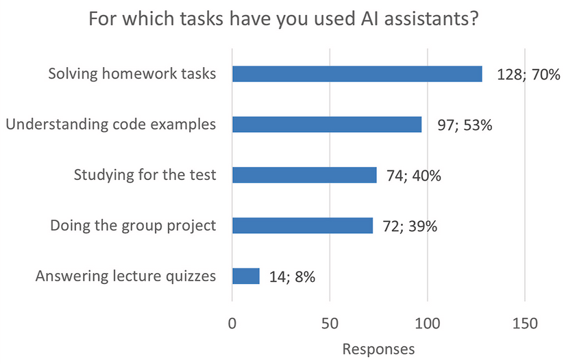

In 2022, the release of ChatGPT marked a significant advancement in the use of Artificial Intelligence (AI) chatbots, particularly impacting fields like computer science and education. The ability to generate code snippets using AI chatbots has introduced new opportunities and challenges in teaching programming. However, there is limited agreement on how students integrate them into their learning processes. This study aims to explore how students utilize AI chatbots in the &ldquo;Object-Oriented Programming&rdquo; course and examine the relationship between chatbot usage and academic performance. To address this, 231 students completed a survey assessing the frequency and manner of chatbot usage. Descriptive statistical methods were employed to analyze usage and perceptions, while Spearman&rsquo;s correlation was used to investigate the connection between chatbot usage and course performance. Results indicated that students primarily relied on AI chatbots for programming tasks. Interestingly, students&rsquo; performance negatively correlates with the reported frequency of using these tools. These findings provide valuable insights for programming educators, offering a better understanding of students&rsquo; perceptions and use of AI chatbots. This knowledge can inform strategies for integrating these tools effectively into computer science education.

# Reference

Marina Lepp, Joosep Kaimre, Computers in Human Behavior Reports,
Volume 18, 2025, [doi.org/10.1016/j.chbr.2025.100642](https://doi.org/10.1016/j.chbr.2025.100642)

