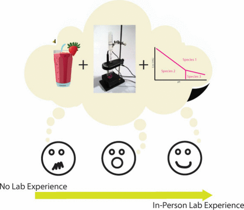

The COVID-19 pandemic was an unprecedented event that, out of necessity, drastically changed the way undergraduate chemistry courses were taught. With the cancellation of in-person classes, laboratory experiences were delayed and/or moved to the virtual space, the latter keeping the general framework of the laboratory experiment but removing the benchwork. In this program assessment, we used a set of timed surveys to assess the effects of delayed physical lab experiences and how an in-person inquiry-based laboratory project influences student self-efficacy in an undergraduate analytical chemistry class. Almost three-quarters of the students in this course had never had an in-person laboratory experience in college prior to this semester; many students shared feelings of anxiety and trepidation when approaching the laboratory experience in this intermediate-level chemistry course. In general, >95% of students self-reported feeling higher confidence after completing the project lab experience. Overall, this program assessment brought to light the negative effects brought by delayed physical laboratory experiences in returning to in-person opportunities, especially postpandemic.

# Reference

Amanda Rae Buchberger, Jericha Mill, *J. Chem. Educ.*, 2025, [https://doi.org/10.1021/acs.jchemed.4c00772](https://doi.org/10.1021/acs.jchemed.4c00772)

