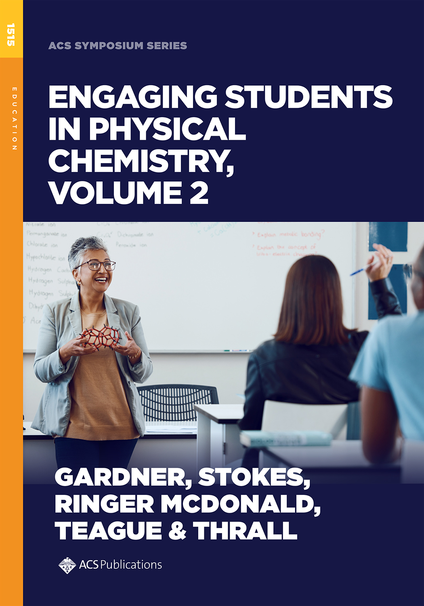

Capture Students' Interest in Physical Chemistry. Engaging Students in Physical Chemistry, Volume 2 compiles recent innovations in teaching undergraduate physical chemistry, ranging from overarching course design to specific classroom and laboratory activities. This volume highlights both longstanding themes and newer developments in physical chemistry pedagogy, with topics including innovations in course structure and grading, incorporation of computation and programming, and an emphasis on strengthening scientific communication skills.

**Chapter Titles**

-   A CURE-like Experience in the Physical Chemistry Laboratory: Adsorption for Environmental Remediation is a Flexible Framework for Promoting Student Engagement
-   Flipped Classroom in Physical Chemistry: Class Design, In-Class Activities, and Effectiveness
-   Design and Implementation of the Math for PChem Foundation Modules
-   Equation Mapping: The Adaptation of Concept Mapping to the Physical Chemistry Classroom
-   Leveraging Physical Chemistry for Student Growth and Belonging
-   First Impressions Matter: How to Write a Learning-Focused Syllabus for Physical Chemistry
-   Specifications Grading in Physical Chemistry Lecture Courses: Catalyzing Student Success and Finding the Right Equilibrium
-   Two Courses in One Room: Teaching Physical Chemistry for Both B.S. and B.A. Degrees
-   Engaging Students in a Sequence of Upper-Level Physical Chemistry Laboratory Courses to Finalize Their Undergraduate Education
-   Teaching Thermodynamics with Geometry and Computational Guided Inquiry
-   Jupyter Notebooks in the Colab Environment: An Accessible Approach for Incorporating Python Coding in Teaching and Learning Quantum Mechanics and Spectroscopy
-   Using Jupyter Notebooks in a Guided Inquiry Laboratory Environment
-   Full Integration of Python into the Physical Chemistry (Thermodynamics and Kinetics) Curriculum
-   Incorporating R Programming into the Physical Chemistry Laboratory
-   Utilizing Computational Software to Streamline Data Analysis and Reinforce Chemical Concepts
-   Teaching Chemists to Code with Diversity in Mind: A Pedagogy of Belonging for End-User Conditions
-   Modernizing Physical Chemistry: Integrating Computational Chemistry, the Finite Well, and Python Data Visualization in the Particle-in-a-Box Experiment
-   Using PGOPHER, HITRAN, and Ab Initio Tools to Stimulate Student Interest in Hydrogen Halide Spectroscopy
-   Symmetry and Spectroscopy: Development of a Guided Inquiry Laboratory Activity
-   Utilizing Time-Resolved Nanosecond Transient Absorption Spectroscopy to Investigate Zinc-Tetraphenylporphyrin Dynamics
-   Using DFT-B3LYP Calculations to Explore Topics in Physical Chemistry
-   Understanding Chemical Equilibria: A Python Tool for Modeling Protonation State Relative Concentrations
-   Physical Chemistry Concepts Introduced into the Chemistry Curriculum Using WebMO
-   Implementing Orbital Coupling Diagrams in Physical Chemistry Courses: A Glyph-Based Iconography for Atoms, Bonding, and Molecules
-   Student Poster Project: An Inexpensive Way to Bring Modern Research into a Physical Chemistry Laboratory Course
-   Using Phenomena in Teaching Physical Chemistry: Designing a Course With Student Learning in Mind
-   Using Writing to Engage Students and Diversify Activities in Physical Chemistry
-   Developing Scientific Writing Abilities through Scaled Guided and Active Learning Cycles: A Template and Example in the Physical Chemistry Laboratory
-   Customized Video Modules to Enhance Student Learning in Physical Chemistry Laboratory Courses

# Reference

Editors: David E. Gardner, Grace Y. Stokes, Ashley Ringer McDonald, Craig M. Teague, Elizabeth S. Thrall, ACS Symposium Series, 2025, [DOI:10.1021/bk-2025-1515](https://doi.org/10.1021/bk-2025-1515)

