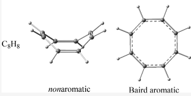

This review describes a computational chemistry exercise aimed at enhancing the understanding of upper-division undergraduates in organic chemistry and physical chemistry regarding the structures and aromaticities of cyclobutadiene and cyclooctatetraene. This exercise exposes students to chemical problems that require computational methods as a necessary supplement to chemical intuition, emphasizing the importance of computational work in contemporary chemistry. Specifically, students learn about topics such as building models, geometry optimization, vibrational frequency analysis, and nucleus-independent chemical shift calculations. The exercise effectively improves students’ comprehension of the relationship between molecular structure and electronic properties as well as the Hü ckel and Baird rules of aromaticity and the concept of aromaticity/antiaromaticity/nonaromaticity.

# Reference

Dongju Zhang, Journal of Chemical Education Article ASAP

[DOI: 10.1021/acs.jchemed.3c00376](https://doi.org/10.1021/acs.jchemed.3c00376) 

