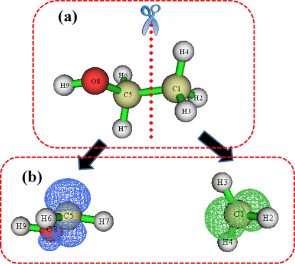

Mechanochemistry is a rapidly evolving field in chemistry, but learning and understanding mechanochemistry is challenging for college students due to its intricate microscale mechanisms. This study focuses on utilizing quantum chemistry simulations as a teaching exercise to facilitate a deeper understanding of mechanochemistry. By integrating computational tools into the learning process, students gain insight into the underlying mechanochemistry mechanisms and appreciate the significance of quantum chemistry in elucidating mechanochemical reactions. Through the analysis of key quantum chemical parameters, such as system energy, bond lengths, bond orders, and spin density, students explore the intricacies of mechanochemical reactions. This teaching exercise not only cultivates students’ chemical intuition and innovative thinking abilities but also provides educators with an engaging and effective teaching method.

# Reference

Chuan Wang and Ziqiu Wang, *J. Chem. Ed.*, 2024, [DOI: 10.1021/acs.jchemed.4c00523](https://doi.org/10.1021/acs.jchemed.4c00523)

