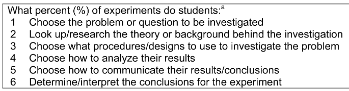

A national survey on chemistry instructional laboratories was administered to faculty members at four-year postsecondary institutions in the United States for the purpose of exploring levels of inquiry-based instruction implemented in laboratory courses. Respondents were asked to rate the level of choice their students had in deciding six key characteristics of the experiments used in their course (e.g., what research questions to explore); the more choices students get to make, the more inquiry-based instructional experience. MANOVA and post hoc analyses suggest that there are differences in the level of inquiry across chemistry course levels; lower-level courses (i.e., general chemistry and organic chemistry) implement lower levels of inquiry-based laboratory instruction compared to upper-level courses (i.e. more chemistry major-focused courses). We found no evidence of association between the level of inquiry courses and institutions’ highest chemistry degree awarded, American Chemical Society approval to award certified bachelors degrees, or external funding to transform postsecondary chemistry courses. Our study contributes to the chemical education community&rsquo;s growing understanding of the state of postsecondary chemistry laboratory instruction. Results further suggest that there is an opportunity for faculty members and department leaders to reflect on their instructional laboratory courses and implement more inquiry-based instructional laboratory experiences across the entirety of the postsecondary chemistry curriculum.

# Reference

Zammit, Kendall M.; Connor, Megan C.; Raker, Jeffrey R.; *Chem. Educ. Res. Pract.*, 2023

[DOI 10.1039/D3RP00154G](http://dx.doi.org/10.1039/D3RP00154G)

KEYWORDS:

