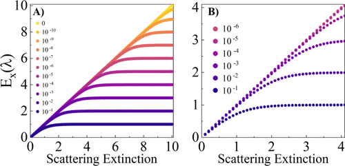

UV–visible (UV–vis) spectrophotometry is a fundamental analytical technique widely used in chemistry, biology, materials science, and medical research. Despite its significance, undergraduate education often presents UV–vis spectroscopy narrowly as an absorbance-based method governed by the Beer–Lambert Law. This traditional framework, while effective for idealized solutions, fails to address the complexities of real-world samples that scatter or emit light, leading to widespread challenges in data interpretation. To bridge this gap, this work introduces an expanded pedagogical approach that incorporates the theoretical foundations of UV–vis spectroscopy for solutions exhibiting diverse optical behaviors. These include pure absorbers, pure scatterers, simultaneous absorbers and scatterers, simultaneous absorbers and emitters, and solutions that encompass absorption, scattering, and emission. We present accessible theoretical models designed to accommodate students with varying levels of mathematical proficiency, parametrizing UV–vis signals within the capabilities of standard spectrophotometers. Additionally, we outline instructional strategies to enhance comprehension across different educational levels, making these advanced concepts more approachable. This framework lays the groundwork for future studies that will feature laboratory modules leveraging commercially available UV–vis and fluorescence spectrophotometers to reinforce hands-on, evidence-based learning. By broadening the scope of UV–vis education and addressing critical gaps in traditional instruction, this work aims to deepen students’ conceptual and practical understanding of spectroscopic analysis. Furthermore, it seeks to rectify common misinterpretations in the literature, equipping students with the analytical skills necessary for accurate, rigorous spectral interpretation. Ultimately, this effort aspires to transform UV–vis spectroscopy education by fostering both theoretical and practical mastery, preparing students for the challenges of modern scientific research and industry applications.

# Reference

Pathum Wathudura, Huy Pham, Kumudu Siriwardana, Sumudu Athukorale, Udaya Jayasundara, Sameera R. Gunatilake, Zhong-Yan Cao, Willard E. Collier, Alena Moon, Dongmao Zhang\*, *J. Chem. Educ.*, 2025, [doi.org/10.1021/acs.jchemed.5c00255](https://doi.org/10.1021/acs.jchemed.5c00255)

