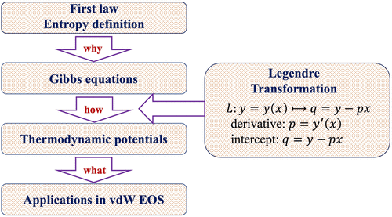

Thermodynamic potentials, such as Helmholtz free energy and Gibbs free energy, are important concepts in thermodynamics. The precise definition of these potentials requires knowledge of statistical mechanics and Legendre transformation. It is hard to understand the underlying physics of thermodynamic potentials for undergraduates. Herein, we developed an alternative approach for introducing thermodynamic potentials to undergraduates. The approach starts from fundamental laws and concepts in thermodynamics with the introduction of Legendre transformation in a comprehensible way. Thermodynamic potentials are explained for their underlying physics in a why-how-what way by means of MATLAB software. All of the knowledge used is still in the learning scope of undergraduates. Research frontier about classical density-functional theory in modern thermodynamics is introduced naturally for students. The pedagogical approach has been taught in China in full English language for students from worldwide regions in three courses in terms of thermodynamics. Students demonstrated the ability to understand fundamental concepts in thermodynamics after they learned the approach.

# Reference

Xiaofei Xu, Weiqiang Tang, Qingwei Gao, Chongzhi Qiao, Yangfeng Peng, Shuangliang Zhao, *J. Chem. Ed.*, 2024,  [doi.org/10.1021/acs.jchemed.4c00351](https://doi.org/10.1021/acs.jchemed.4c00351)

