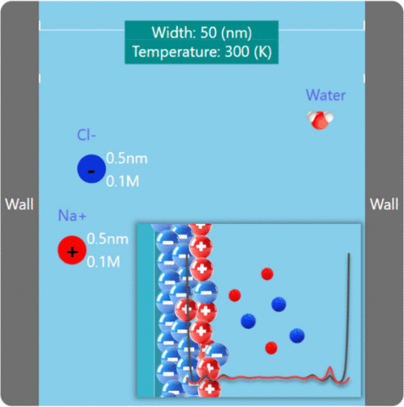

The structure and properties of solid–liquid interfaces have long been central topics in interfacial science, and various theoretical methods have been developed to accurately describe the species therein. However, many of these approaches remain complex and difficult to implement in educational contexts. Herein, we present a web-based software platform for fluid interface thermodynamics that features a user-friendly graphical interface specifically designed for educational use. The platform integrates several widely used computational models, including Poisson–Boltzmann, Poisson–Nernst–Planck, and classical density functional theory. This study aims to support the teaching and learning of interfacial phenomena by allowing students, particularly those without programming experience, to effectively interact with and explore fluid interface simulations.

# Reference

Q. Wang, et al, J. Chem. Educ. 2025, 102, 8, 3623–3630, [doi.org/10.1021/acs.jchemed.5c00084](https://doi.org/10.1021/acs.jchemed.5c00084)

