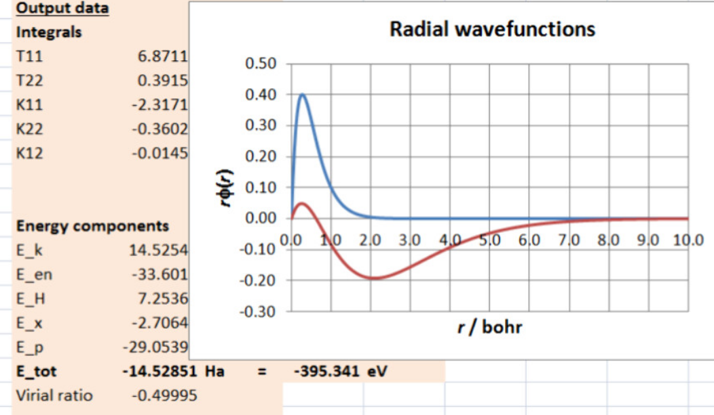

We present a suite of three workbooks implementing different methods and levels of approximations of quantum chemistry for elements from hydrogen to beryllium: two variants of Hartree–Fock (HF) of increasing complexity and the local spin-density approximation (LSDA) of density functional theory (DFT). Hydrogen-like basis functions for the 1s and 2s orbitals have been chosen, with associated effective charges treated as adjustable parameters. Instead of solving self-consistent equations, the total energy is minimized directly with respect to the orbital effective charges with the aid of the Solver add-in of Excel or by means of the virial theorem. The workbooks provide interactive input of the spin occupations of 1s and 2s orbitals, thus allowing calculation of the total energy not only of the ground-state neutral atoms but also of the first excited singlet and triplet states of helium and helium-like atoms, of the hydrogen anion H- (hydride), and of the lithium and beryllium cations. The calculated total energies are compatible with those obtained by elaborated general-purpose quantum chemistry programs. The workbooks are suitable for upper-division undergraduates or postgraduate students with no previous programming experience. They are open for upgrade and could be used for different forms of computer-based learning in the frame of classroom activities or coursework assignments. The educational outcomes of using spreadsheets in the teaching environment have been quantified by means of Hake’s normalized gain analysis.

# Reference

V. G. Ivanov and B. D. Slavchev, *J. Chem. Educ.* 2024,  [DOI: 10.1021/acs.jchemed.4c00777](https://doi.org/10.1021/acs.jchemed.4c00777 )

