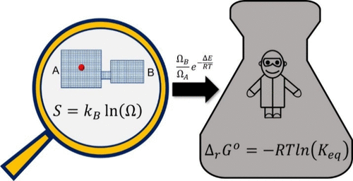

The equilibrium constant and Gibbs energy are central to understanding and controlling chemical processes. Yet, a pedagogical gap persists in clarifying the connection between these macroscopic quantities and the Boltzmann entropy equation, $S = kB ln(Ω)$, which forms the foundation of statistical thermodynamics. This disconnect often creates misconceptions about entropy and limits learners’ full understanding of it from a statistical perspective. Here, we present a pathway to derive the equilibrium constant directly from Boltzmann entropy, from which the Gibbs energy and the Boltzmann distribution naturally emerge. This approach clarifies the connections among these quantities by deriving them directly from the phase space, making the statistical origins of equilibrium thermodynamics explicit. We demonstrate the conceptual and instructional advantages of the statistical approach through representative examples and student assessment. Our primary audience is instructors who wish to clarify the statistical–mechanical foundations of equilibrium thermodynamics within physical science curricula while emphasizing conceptual clarity over formal mathematical abstraction.

# Reference

Sean Parsons, Kana Takematsu, Jahan Dawlaty, *J. Chem. Educ.*, 2026, [doi.org/10.1021/acs.jchemed.5c01619](https://doi.org/10.1021/acs.jchemed.5c01619)

