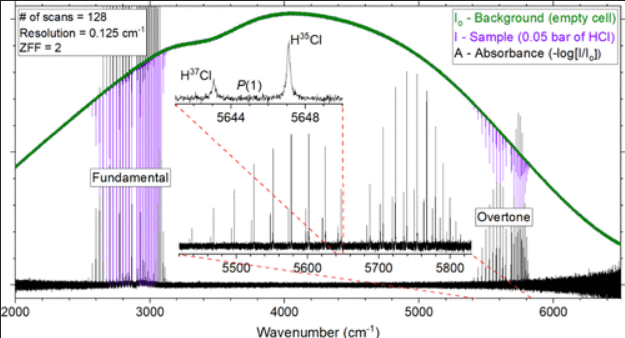

We developed a gas-phase Fourier Transform InfraRed Scientific Instrument Simulator (FTIR-SIS, <https://ftir.rastonlab.org/>) in response to the unavailability of one during the COVID-19 pandemic lockdown of 2020. It features an interactive interface that encourages students to explore different components of a typical FTIR, and it allows them to set up and collect realistic synthetic spectra for a wide variety of atmospherically relevant molecules (CO, HCl, O3, HCN, etc.). This is facilitated by utilizing the HITRAN (HIgh-resolution TRANsmission molecular absorption) database and a radiative solver (RADIS, RADIative Solver for infrared spectra of molecules). Students from around the world will be able to access this SIS on any device (laptop, smartphone, etc.) and perform simulated gas-phase FTIR experiments that mimic real ones.

# Reference

Brenna Sermania, Nicholas VanFossen, Ray Steen, Michael Stewart, and Paul L. Raston,
Journal of Chemical Education ASAP,
[DOI: 10.1021/acs.jchemed.3c01161](https://doi.org/10.1021/acs.jchemed.3c01161)

[FTIR-SIS](https://ftir.rastonlab.org/)

