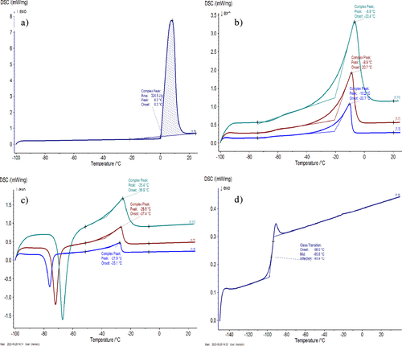

This study describes a laboratory experiment performed with undergraduate physical chemistry students utilizing differential scanning calorimetry (DSC) to determine a eutectic phase diagram, measure solution glass transition temperatures (Tg), and predict the glass transition temperature (Tg) of water. The DSC techniques employed determine accurate equilibrium freezing temperatures (Tf) of glycerol–water mixtures with glycerol mole fractions (xg) between 0 and 0.201. When xg ≥ 0.300, the slow rate of crystallization of glycerol inhibits crystallization, and solutions exhibit a Tg rather than a Tf. The Tf&rsquo;s serve to discuss solid–liquid equilibria and estimate eutectic phase diagrams with varying levels of accuracy. The Tg&rsquo;s serve to estimate the Tg of water (135.3 ± 1.2 K). Together, these behaviors allow for discussion of glycerol&rsquo;s effectiveness as a cryoprotectant.

# Reference

Alexander D. Schwab, *J. Chem. Educ.*, 2024, 101 (4), 1696-1702, [10.1021/acs.jchemed.4c00102](https://doi.org/10.1021/acs.jchemed.4c00102)

