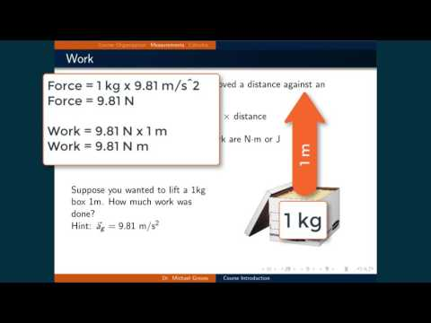

# Course description

Thermodynamics and kinetics; properties of gases and solutions; molecular structure and energies and application to spectroscopic techniques; liquids, phase equilibria, thermodynamics of multicomponent systems with application to the life sciences. 

# Course Objectives

1.  Develop thermodynamic concepts such as work, heat, enthalpy, entropy and Gibbs free energy. (How do we quantify chemical processes?)
2.  Define the concept of spontaneity and use it to analyse single and multicomponent systems to determine the outcome of a chemical process. (What chemical processes tend to occur?)
3.  Develop the concept of activity under ideal and real systems and relate it to chemical equilibrium. (What happens to chemical processes after a long time?)
4.  Distinguish between different types of rate law expressions and combine them to solve for the kinetic values of a chemical process. (How long does it take for a chemical process to occur?)

# Course Materials

[Sample syllabus](CHEM361A_Spring2022_Syllabus_piper.pdf) 

[Course Activities](activities.md) In-class and homework problems

[Lecture Slides](lecture_slides.md) from YouTube lecture videos

[Lecture Videos](https://www.youtube.com/playlist?list=PL_j40xIfCA33azpQKaIefMxae6PhrOoOk) YouTube playlist

# Author

Michael Groves, California State University Fullerton, [mgroves@fullerton.edu](mailto:mgroves@fullerton.edu)

# License

[CC BY-NC-SA](https://creativecommons.org/licenses/by-nc-sa/4.0/)

