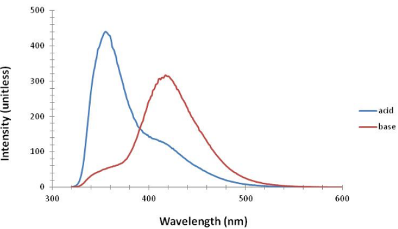

## What is this experiment about?

When a molecule absorbs light, the electron density rearranges, and the molecular geometry changes. Students can observe changes in the acidity of β-naphthol after electronic excitation, which provides indirect confirmations of these changes. This experiment has students develop a stronger understanding of Beer’s Law, observe the relationship between absorption and fluorescence spectra, and extend the concept of acidity to electronically excited molecules. Students should be familiar with Beer’s Law, absorption spectroscopy, and acid dissociation constants.

## What do students do?

Students obtain UV-visible absorption spectra of β-naphthol over a range of pH values to obtain the ground state pKa. Students then obtain fluorescence spectra of the acid and conjugate base. A Förster cycle analysis gives the pKa of the excited electronic state. The class works together to decide on a buffer pH range to use, make solutions, collect data together to get a reliable result, and interpret the spectra of the acid and conjugate base. The full set of experiment cycles typically require two three-hour lab periods to complete.

## What equipment and supplies will you need?

-   UV-visible absorption spectrophotometer
-   Fluorescence spectrometer with excitation at ≈310 nm. (Fluorescence spectra are available in the instructor handbook if this is not available)
-   <1 g of β-naphthol
-   Solutions of HCl, NaOH, NH4OH, and NH4Cl

## What makes this experiment a physical chemistry experiment?

Physical chemistry uses theory and experiment to provide access to molecular properties and behavior in a way that students have not seen in previous classes. That an excited state will have a different pKa than the ground state is a new concept for students. Students consider pKa as a property traditionally determined using titration, so measuring the pKa of a species that they do not chemically isolate is novel, as are the models necessary to extract that value from spectroscopic data.

## And what makes it a POGIL-PCL experiment?

Students *make predictions* about the relative pKa values of the acid and base form of β-naphthol and the spectra of those forms. They share and interact with each other, both in experimental design decisions (for example, which buffers to use) and in sharing data to build conclusions. They apply *mathematical models* to data, building from the Förster cycle and graphical interpretation of the spectra to obtain pKa values.

# Reference

Lead author: Sally Hunnicutt

[View student handout](https://chemistry.coe.edu/piper/pclform.html?expt=pyreneExcimer)

The Instructor’s Handbook with implementation details, sample data, and expected answers is available through the [POGIL-PCL project](https://www.pogilpcl.org/get-connected). 

Highlights author: Rob Whitnell, Gilford College

