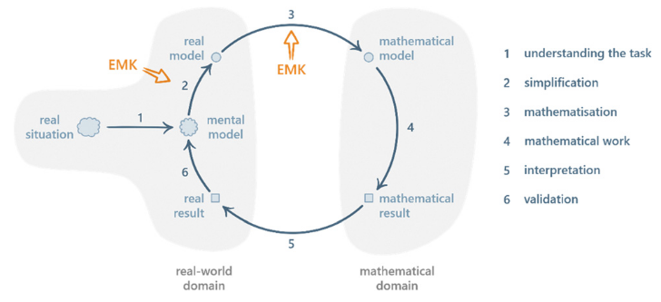

Problem solving in chemical kinetics poses substantial challenges for university students since it often involves significant use of mathematics as a tool and language, with challenging translations and transitions between chemical phenomena and mathematical representations. In this paper, we present key findings from a study investigating chemistry students solving tasks centred around the steady-state approximation. Building upon the mathematical modelling cycle (MMC), qualitative analysis of the data collected using a think-aloud protocol led to the development of the extended MMC. This empirically derived extended MMC offers a more detailed account of the processes involved in mathematical modelling of chemical phenomena, highlighting aspects such as the occurrence of deliberation and evaluation throughout the modelling cycle, as well as the varying characteristics, points of activation and roles of extra-mathematical resources during problem solving. We further introduce and use problem- solving trajectories as a tool for visualising and analysing the complex and diverse approaches used by students in their attempts at reaching a solution. Overall, the extended MMC provides a finer-grained model of the cognitive and metacognitive activities that students engage in, offering further insights for research and practice.

# Reference

Sofie Ye, Maja Elmgren, Magnus Jacobsson, and Felix M. Ho, Chem. Educ. Res. Pract., 2023, [doi.org/10.1039/D3RP00168G](https://doi.org/10.1039/D3RP00168G)

